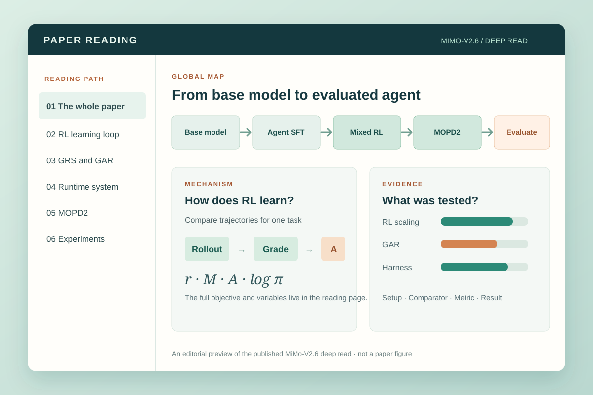

# Paper Reading Skill

**把一篇论文读成一份可视化阅读图谱。** 这是帮助研究者、学生和工程师深入阅读学术论文的开源 agent skill。提供 PDF 或论文链接后，普通的“读这篇论文”请求会得到一份独立的 HTML 文档，读懂全局论证、方法或证明、重要公式与实验。

[项目主页 →](https://xiaofengshi.github.io/paper-reading-skill/zh.html) · [阅读 MiMo-V2.6 完整样例 →](https://xiaofengshi.github.io/paper-reading-skill/mimo-v2.6-deep-read.html) · [English](README.md)



## 阅读完整样例

选一篇论文，就能在一个页面里沿全局图、机制说明、原论文图、公式和实验证据读完整篇。图示与重要数字均有相邻解释，原文定位按需显示。

- **Attention Is All You Need · English。** 沿编码器与解码器追踪 token，算清注意力公式，再读翻译实验、消融和句法分析。 [打开完整深读 →](https://xiaofengshi.github.io/paper-reading-skill/attention-is-all-you-need-deep-read.html)
- **DeepSeek-V4.1-Flash · English。** 分清预填充计算、运行时全局 KV 和持久化 KV，结合原论文图读 CED、CSA2 和 Agent 评测。 [打开完整深读 →](https://xiaofengshi.github.io/paper-reading-skill/deepseek-v4.1-flash-deep-read.html)
- **MiMo-V2.6 · 中文。** 从训练主线读到 RL 目标、GRS/GAR、运行系统、MOPD2 与实验。 [打开完整深读 →](https://xiaofengshi.github.io/paper-reading-skill/mimo-v2.6-deep-read.html)

MiMo 样例基于一份 44 页的本地 PDF 编写，仓库不分发该 PDF。作者后来[更新了在线报告](https://huggingface.co/XiaomiMiMo/MiMo-V2.6-Pro-RL/commit/73875d00b30a89ef8cc353a0b60b0e9f9561952d)；样例已采用修正后的 Pro 激活参数数值，其他版本差异尚未逐页核对。

## 你会得到什么

1. **全局认知图。** 研究问题、场景、主要想法、贡献及证据进入的位置。
2. **方法或论证路径。** 输入、阶段、分支、反馈和输出，并解释重要箭头的含义。
3. **机制放大。** 必要的定义、公式、假设，以及有帮助时的具体算例。
4. **实验图谱。** 每个问题对应的设置、对照、指标、观察结果与可支持的解读。
5. **综合理解。** 把方法与证据重新连起来，并把限制放在相应结论旁边。

图负责引导阅读；正文、公式、表格和原论文图承载细节。原文位置默认不显示，但需要核对时可以展开。最终交付是一份离线可读的 HTML，另附作为审计源的 Markdown。

## 论文阅读方法

这套流程把已有的论文阅读和知识组织方法，与针对单篇论文的编辑设计结合起来。三个检查分别回答不同问题：

1. **能否先重建论文，再向读者解释？** [Keshav 的三遍阅读法](https://systems.cs.columbia.edu/ds2-class/papers/keshav-paper.pdf)从全局认识，逐步走到内容理解和细节重建。本 skill 先画暂定全局图，再追踪方法与结果，最后推演决定性的公式、假设、证明或实验。普通深读请求会完成整条路径；只有用户要求快筛时才停在概览。
2. **图里的关系是否有明确含义？** [Novak 与 Cañas 的概念图方法](https://cmap.ihmc.us/docs/theory-of-concept-maps)从焦点问题出发，用带说明的连线和跨区关联组织概念。本项目的每张图都回答一个与论文有关的问题，例如“机制如何影响结果”；箭头须说明是数据流、过程顺序还是证据关系，正文解释这些连接。
3. **解读能否回到论文核查？** [SciDoc2Diagrammer-MAF](https://aclanthology.org/2024.findings-emnlp.780/)指出生成的科学图示可能遗漏信息或偏离原文。本项目据此要求核对关键图、公式、数字和箭头，并把每项实验的设置、对照、指标与结果放在一起。本项目并未实现该论文的图示生成算法。

这三项原则形成上文的五层阅读顺序：全局图、主路径、机制、实验图谱和综合理解。衡量深读是否有用，要看读者能否说清核心机制、指出重要结论由哪些证据支撑，而不必为补全关键解释反复查 PDF。这是本项目的方法设计；现有样例尚未经独立读者研究验证。

[公开的深读质量检查](evals/reading-quality.md)将来源覆盖、科学事实、主张与证据的对应、独立可读性和离线交付变成交付门槛。[三篇样例的读者题目与答案](evals/reader-tasks.md)可供未参与编写的人测试理解效果。渲染器测试通过或作者自查，都不等于完成了独立读者研究。

## 开始使用

**在 Codex 项目里快速试用：** 在项目目录运行 [skills CLI](https://github.com/vercel-labs/skills)，然后检查内置渲染器。安装结果位于项目内的 `.agents/skills/paper-reading`。

```bash
npx --yes skills add xiaofengShi/paper-reading-skill --skill paper-reading --agent codex --copy --yes
(cd .agents/skills/paper-reading && npm ci && npm run doctor)
```

**Codex 与 Kimi Code：** 把仓库安装为个人 skill，再安装渲染依赖。仓库附带的 HTML 渲染器需要 Node.js 20 或更新版本。

```bash
mkdir -p "$HOME/.agents/skills"
git clone https://github.com/xiaofengShi/paper-reading-skill.git "$HOME/.agents/skills/paper-reading"
(cd "$HOME/.agents/skills/paper-reading" && npm ci)
```

运行 `(cd "$HOME/.agents/skills/paper-reading" && npm run doctor)` 检查安装。它会在临时目录生成一份完整的 Transformer 样例，并检查语种、公式、导航和内嵌图。

**Claude Code：** 改用它的个人 skill 目录。

```bash
mkdir -p "$HOME/.claude/skills"
git clone https://github.com/xiaofengShi/paper-reading-skill.git "$HOME/.claude/skills/paper-reading"
(cd "$HOME/.claude/skills/paper-reading" && npm ci)
```

此安装路径运行 `(cd "$HOME/.claude/skills/paper-reading" && npm run doctor)`，然后再打开新的 agent 会话。

如果已经安装，直接更新已有目录及依赖，不要在同名目录上再次 `git clone`。Codex 或 Kimi Code 运行 `git -C "$HOME/.agents/skills/paper-reading" pull --ff-only`，再运行 `(cd "$HOME/.agents/skills/paper-reading" && npm ci)`；Claude Code 把路径换成 `$HOME/.claude/skills/paper-reading`。

重新打开 agent 会话，附上 PDF 或给出可访问的论文链接，然后说：**“用中文深入阅读这篇论文，给我一份可视化 HTML 文档，讲清主线、重要公式和实验。”** 也可以明确要求英文。Skill 默认遵循用户请求的语种；没有任何语种线索时使用英文。Skill 名称是 `paper-reading`；也可以在 Codex 输入 `$paper-reading`，在 Claude Code 输入 `/paper-reading`，在 Kimi Code 输入 `/skill:paper-reading`。Agent 必须能访问论文并完成科学阅读；本项目提供阅读流程与渲染器，并非把任意 PDF 自动转换成已核实解读的服务。

只有需要快筛时才要求概览；需要审稿或与自己的研究比较时，再要求额外视角。普通读论文请求以理解论文为主。

## 工作方式

[Skill 指令](SKILL.md)引导 agent 依次建立全局认知、重建全文、编写解释并核对来源。[论文类型协议](references/paper-types.md)为实证、系统、基准、数据集、理论和综述论文选择合适图形；[可视化阅读规则](references/visual-reading.md)要求图示与解释、证据对应。[阅读模式](references/reading-modes.md)定义可选的快筛、审稿和研究视角。

仓库附带的[渲染器](scripts/render-reading.cjs)把 Markdown 审计源与本地图形生成单文件 HTML，内嵌图片、图示、KaTeX 数学排版和字体。每份源文档都必须在首行写明 `<!-- paper-reading-lang: en -->` 或 `<!-- paper-reading-lang: zh-CN -->`，导航和图表标签也据此选择语种。Archify 可以呈现可选的交互结构图，但构建不依赖 Archify 或其他本地 skill。[Transformer](examples/attention-is-all-you-need-deep-read.md)、[DeepSeek](examples/deepseek-v4.1-flash-deep-read.md)和[MiMo](examples/mimo-v2.6-deep-read.md)的 Markdown 与图形输入都是构建材料，不要求读者分别打开。

本地重建所有已发布样例：

```bash
npm ci
npm run doctor
npm run build:examples
npm test
```

## 验证与适用范围

三个文档分别覆盖经典架构论文，以及机制和评测结构不同的两份技术报告。渲染测试覆盖语言声明、行内与独立公式、原文位置开关、原图上下文和数值图行为。这些检查验证排版与生成契约，不等于独立核证每一条科学解读。理论、综述、数据集和独立读者测试仍不在当前样例范围内。

[Archify](https://github.com/tt-a1i/archify)是可选的交互结构图呈现工具。科学内容仍须对照论文核查。

欢迎在 [GitHub Issues](https://github.com/xiaofengShi/paper-reading-skill/issues)提交问题、缺陷或其他论文类型的样例。项目使用 [MIT 许可证](LICENSE)。

## 维护说明

本文是[中文主页](https://xiaofengshi.github.io/paper-reading-skill/zh.html)的内容源；[README.md](README.md)是默认[英文主页](https://xiaofengshi.github.io/paper-reading-skill/)的内容源。修改任一语言后运行 `npm run build:docs`，将生成的 HTML 与 Markdown 一同提交。主页生成器见 [scripts/build-docs.cjs](scripts/build-docs.cjs)。
