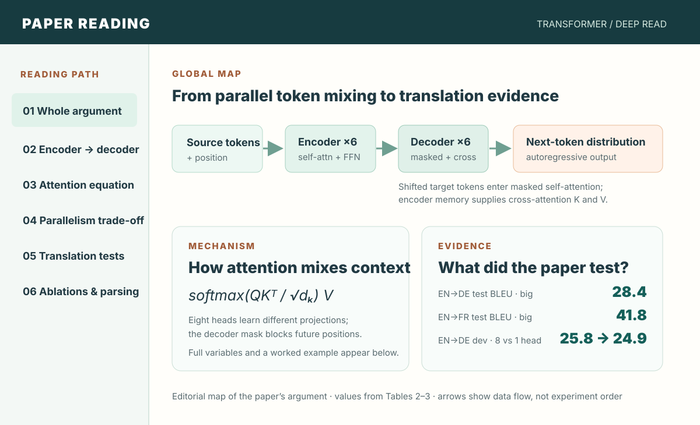
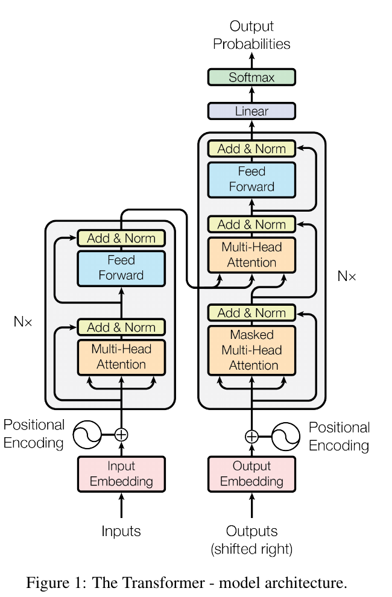

<!-- paper-reading-lang: en -->
<!-- paper-reading-theme: cobalt -->
# Attention Is All You Need: reading the Transformer from path to evidence

> **Reading orientation.** The 2017 paper asks whether an encoder–decoder model can perform sequence transduction without recurrence or convolution. Its answer is a stack of attention and position-wise feed-forward layers, tested mainly on machine translation. This reading uses [arXiv version 7](https://arxiv.org/abs/1706.03762); the author's original figure is attributed below. <span class="source-ref">Version revised 2 August 2023. Local PDF SHA-256: bdfaa68d8984f0dc02beaca527b76f207d99b666d31d1da728ee0728182df697. PDF abstract, §§1–6; Fig. 1; Tables 1–4.</span>

```paper-map
{
  "thesis":"The paper replaces sequence-aligned recurrence with attention, then asks whether translation quality and training efficiency survive that replacement.",
  "outcome":"A parallelizable encoder–decoder path with measurable translation quality; the decoder still emits output tokens autoregressively.",
  "outcomeSource":"PDF §§1, 3, 4, 6",
  "items":[
    {"number":"01","label":"Problem","signal":"sequential RNN states","text":"Recurrence ties training computation across positions to previous hidden states; long dependencies also have long signal paths.","source":"PDF §§1–2, 4"},
    {"number":"02","label":"Mechanism","signal":"attention + position","text":"Encoder self-attention, masked decoder self-attention and encoder–decoder attention replace recurrent state updates.","source":"PDF §3, Figs. 1–2"},
    {"number":"03","label":"Evidence","signal":"translation + ablations","text":"WMT14 test BLEU, model variations on a development set, and WSJ parsing probe quality and components.","source":"PDF §6, Tables 2–4"}
  ]
}
```

## 01 / The whole argument

The contribution is a **model architecture**, not an attention score alone. Earlier sequence-to-sequence systems could use attention while retaining recurrent encoder and decoder layers. The Transformer replaces those layers with attention plus a position-wise network. That permits all source positions, and all target positions during teacher-forced training, to be processed together. At generation time the decoder remains autoregressive: it must predict the next target token from the prefix already produced. (PDF §§1–3)

The editorial diagram starts with the paper's question: can sequence transduction work without recurrent layers? Its answer links attention-based token mixing and position information to the encoder–decoder data path. The lower cards connect that design to the attention calculation and the translation tests and ablation used to examine it. The top-row arrows describe data flow. The listed BLEU values are exact reported results, with their settings explained below. (PDF Fig. 1, Eq. 1, Tables 2–3)



*Editorial diagram based on the paper's Fig. 1 and Tables 2–3; the numbers are the paper's reported BLEU values. The full settings and comparisons appear in §§05–06 below.*

## 02 / Follow a token through the architecture

The model has a six-layer encoder and a six-layer decoder in its base configuration. The encoder turns source tokens into contextual representations; the decoder takes the shifted target prefix and repeatedly predicts its next token. Figure 1 is particularly useful here: read its left stack as the encoder, its right stack as the decoder, and the long arrow between them as the source memory supplied to cross-attention. The diagram below the original figure expands each step. (PDF §3.1, Fig. 1)



*Original paper Fig. 1, arXiv v7 PDF p. 3. In the right stack, the bottom attention block is causally masked, while the middle attention block reads encoder output. “N×” denotes repeated layers.*

```paper-path
{
  "title":"From source sentence to next-token probability",
  "intro":"The encoder and decoder are different computations; the three attention placements must not be collapsed into one generic attention block.",
  "stages":[
    {"title":"Embed source and add position","role":"input representation","action":"Map source tokens to 512-dimensional vectors and add a positional encoding, so a model without recurrence can use token order.","why":"Attention by itself sees a set of vectors and needs position information to distinguish permutations.","output":"Ordered source representations for the encoder.","source":"PDF §§3.4–3.5"},
    {"title":"Encode source with six layers","role":"contextual memory","action":"Each layer applies multi-head self-attention and a position-wise feed-forward network, each with a residual connection followed by layer normalization.","why":"Every source position can exchange information with other source positions without a recurrent hidden-state chain.","output":"Encoder outputs available as memory to the decoder.","source":"PDF §3.1, Fig. 1"},
    {"title":"Read the shifted target prefix","role":"causal decoding","action":"The decoder's first attention sublayer sees earlier target positions but masks later ones; shifted target embeddings prevent access to the answer token.","why":"Training may process target positions in parallel, but prediction at position i must depend only on earlier outputs.","output":"A target-side state with no future-token leak.","source":"PDF §§3.1, 3.2.3, Fig. 1"},
    {"title":"Attend to source memory","role":"cross-attention","action":"Decoder states form queries; encoder outputs provide keys and values. A feed-forward sublayer then transforms each position.","why":"The target prediction needs relevant source information as well as its own prefix.","output":"A decoder representation conditioned on source and target prefix.","source":"PDF §§3.1–3.3"},
    {"title":"Project to the next token","role":"output distribution","action":"A linear map and softmax produce token probabilities; generation appends a selected token and repeats.","why":"The architecture is parallel across training positions but decoding still advances one output step at a time.","output":"An autoregressive target sequence.","source":"PDF §§3.1, 3.4, Fig. 1"}
  ]
}
```

The encoder has two sublayers per layer. The decoder has three because it adds cross-attention between masked self-attention and the feed-forward network. The paper writes each residual sublayer output as $\mathrm{LayerNorm}(x+\mathrm{Sublayer}(x))$; this is the paper's **post-normalization** ordering. (PDF §3.1)

## 03 / Compute one attention output

The central operation takes a query matrix $Q$, key matrix $K$, and value matrix $V$. A query's dot product with each key becomes a compatibility score. Dividing by $\sqrt{d_k}$ keeps those scores from growing with key dimension under the paper's stated independent-component illustration; softmax converts scores to weights; the weighted sum of values is the output. The full Eq. 1 is: (PDF §3.2.1, Eq. 1)

$$
\begin{gathered}
\operatorname{Attention}(Q,K,V)\\
=\operatorname{softmax}\!\left(\frac{QK^{\mathsf T}}{\sqrt{d_k}}\right)V.
\end{gathered}
$$

For a **teaching calculation, not a reported paper experiment**, take one query with dot products $[2,0]$ against two keys and let $d_k=4$. Scaling gives $[1,0]$; softmax gives about $[0.731,0.269]$. The output is therefore approximately $0.731v_1+0.269v_2$. In the decoder's masked self-attention, a future key receives a score of $-\infty$ before softmax and thus weight zero. In encoder self-attention there is no such future-token mask. (PDF §§3.2.1, 3.2.3)

**Multi-head attention changes the representations before this calculation.** For each head $i$, learned projections form $Q_i$, $K_i$, and $V_i$; head outputs are concatenated into $H$ and projected once more. The following is the paper's expression written with intermediate names to keep every step legible: (PDF §3.2.2)

$$
\begin{gathered}
Q_i=QW_i^Q,\quad K_i=KW_i^K,\\
V_i=VW_i^V,\\
\operatorname{head}_i=\operatorname{Attention}(Q_i,K_i,V_i),\\
H=\operatorname{Concat}(\operatorname{head}_1,\ldots,\operatorname{head}_h),\\
\operatorname{MultiHead}(Q,K,V)=HW^O.
\end{gathered}
$$

The base model uses $h=8$ heads, $d_{\mathrm{model}}=512$, and $d_k=d_v=64$ per head. The reduced per-head dimensions keep total attention computation roughly comparable to one full-width head while allowing multiple learned subspaces. Multi-head attention is used in **three places**: encoder self-attention, causally masked decoder self-attention, and decoder-to-encoder cross-attention. The query/key/value origins differ in the third case. (PDF §§3.2.2–3.2.3)

Each layer also applies the same two-layer network independently at every position, with different parameters across layers: $\operatorname{FFN}(x)=\max(0,xW_1+b_1)W_2+b_2$. The base model expands from 512 to $d_{ff}=2048$ inside that network. Sine and cosine positional encodings are added at the bottoms of both stacks; the authors also test learned positional embeddings in Table 3. (PDF §§3.3, 3.5, Eq. 2)

## 04 / What parallelism buys, and what it costs

The paper's Table 1 compares **layer types**, rather than end-to-end measured runtime. For a sequence of length $n$ and representation width $d$, unrestricted self-attention has $O(n^2d)$ operations per layer but $O(1)$ sequential depth and an $O(1)$ maximum path between positions. A recurrent layer has $O(nd^2)$ operations and $O(n)$ sequential depth and path. These are asymptotic comparisons under the table's assumptions, not a promise that attention is cheaper at every sequence length. (PDF §4, Table 1)

| Layer type | Operations per layer | Sequential operations | Maximum path |
|---|---:|---:|---:|
| Self-attention | $O(n^2d)$ | $O(1)$ | $O(1)$ |
| Recurrent | $O(nd^2)$ | $O(n)$ | $O(n)$ |
| Convolution, kernel $k$ | $O(knd^2)$ | $O(1)$ | $O(\log_k n)$ |
| Restricted self-attention, neighborhood $r$ | $O(rnd)$ | $O(1)$ | $O(n/r)$ |

The shorter path makes distant positions interact in one attention layer, while the quadratic $n^2$ term makes long unrestricted sequences expensive. The authors explicitly propose restricting attention to a local neighborhood as future work; that would lower per-layer work but lengthen the maximum path. This tension is part of the paper's original argument, not a later long-context result. (PDF §4, Table 1)

## 05 / Training and measurement conditions

The main tests use WMT 2014 English–German translation (about **4.5 million sentence pairs**) and English–French translation (**36 million**). The base model has 65M parameters, six layers per stack, eight heads, and $d_{\mathrm{model}}=512$; the big model has 213M parameters and width 1024. Training uses eight P100 GPUs. The base run is 100,000 steps, about 12 hours; big runs are 300,000 steps, about 3.5 days. These schedules, model sizes, and data sizes matter when reading the BLEU and cost comparisons. (PDF §§5.1–5.2, Tables 2–3)

The authors use Adam with $\beta_1=0.9$, $\beta_2=0.98$, and $\epsilon=10^{-9}$, with 4,000 warmup steps and the learning-rate schedule below. The intermediate terms $a$ and $b$ expose the two branches of the paper's Eq. 3: the expression rises linearly during warmup and falls approximately as inverse square root afterward. Dropout and label smoothing of $0.1$ are part of the base setup. (PDF §§5.3–5.4, Eq. 3)

$$
\begin{aligned}
\operatorname{lrate}&=d_{\mathrm{model}}^{-1/2}\min(a,b),\\
a&=\operatorname{step}^{-1/2},\\
b&=\operatorname{step}\cdot\operatorname{warmup}^{-3/2}.
\end{aligned}
$$

Translation results use BLEU on **newstest2014**; architecture variations use English–German BLEU on the **newstest2013 development set without checkpoint averaging**. The two tables therefore answer different questions and their BLEU values should not be compared as if they were measured on the same split. At inference the translation runs use beam size 4 and length penalty 0.6, with checkpoint averaging described in §6.1. (PDF §6.1–6.2, Tables 2–3)

## 06 / Read the experiments as answers to questions

```paper-experiments
{
  "title":"Which result tests which part of the argument",
  "rows":[
    {"question":"Can an attention-only model translate competitively?","setup":"WMT14 EN→DE newstest2014 BLEU; compare Transformer base and big with prior single models and ensembles in Table 2.","observation":"Base: 27.3 BLEU; big: 28.4. The strongest listed prior ensemble is ConvS2S at 26.36. This supports the full architecture's translation result, not a single component's isolated effect.","source":"PDF §6.1, Table 2"},
    {"question":"Does the result hold on a larger translation corpus?","setup":"WMT14 EN→FR newstest2014 BLEU; Table 2 compares the big model with earlier systems, including ConvS2S ensemble 41.29.","observation":"The table and abstract give 41.8 for Transformer big. The §6.1 prose says 41.0 instead; the discrepancy is recorded below rather than silently reconciled.","source":"PDF abstract, §6.1, Table 2"},
    {"question":"Does one head replace several?","setup":"EN→DE newstest2013 development BLEU; Table 3 row A changes head count while keeping reported computational work approximately constant.","observation":"Base 8 heads: 25.8; one head: 24.9; 16 heads: 25.8; 32 heads: 25.4. The controlled variation supports a useful middle range of heads in this setup.","source":"PDF §6.2, Table 3 row A"},
    {"question":"Are fixed sinusoids essential to this result?","setup":"EN→DE development BLEU; Table 3 row E replaces sinusoidal positions with learned positional embeddings.","observation":"Learned positions score 25.7 versus base 25.8. This comparison does not show a meaningful advantage for fixed sinusoids on this tested split.","source":"PDF §§3.5, 6.2, Table 3 row E"},
    {"question":"Can the architecture transfer beyond translation?","setup":"English constituency parsing on WSJ section 23; the paper trains a four-layer Transformer with WSJ-only and semi-supervised data.","observation":"WSJ-only F1 is 91.3, below the 91.7 recurrent grammar listed; semi-supervised F1 is 92.7, above other listed semi-supervised systems at 92.1. Training regimes differ, so this is a transfer demonstration, not a uniform win.","source":"PDF §6.3, Table 4"}
  ]
}
```

**Keep the main test values in view.** Table 2 reports the following BLEU values; the EN→DE and EN→FR columns are different tasks, and a blank cell means that row has no reported value for that task. The cost column is the paper's estimated training FLOPs, not a measurement of serving latency. (PDF §6.1, Table 2)

| System | EN→DE test BLEU | EN→FR test BLEU | EN→DE training FLOPs | EN→FR training FLOPs |
|---|---:|---:|---:|---:|
| Transformer base | 27.3 | 38.1 | $3.3\times10^{18}$ | — |
| Transformer big | **28.4** | **41.8** | $2.3\times10^{19}$ | — |
| ConvS2S ensemble | 26.36 | 41.29 | $7.7\times10^{19}$ | $1.2\times10^{21}$ |

For EN→FR, the abstract and Table 2 say **41.8**, but a sentence in §6.1 says **41.0**. The source itself is inconsistent. This atlas uses 41.8 when reading Table 2 and does not turn either number into a more precise conclusion than the paper supports. The Table 3 head and positional comparisons are development-set ablations; Table 4 parsing uses F1 and a different task. (PDF abstract, §6, Tables 2–4)

## 07 / What the mechanism and evidence establish together

The architecture path explains how attention can replace sequence-aligned recurrent updates while preserving source–target conditioning: source tokens interact through encoder self-attention, the decoder sees only its target prefix, and cross-attention connects the two stacks. Table 1 gives the computational reason to try it; Table 2 shows strong translation outcomes; Table 3 gives narrower evidence for choices such as multiple heads; Table 4 probes transfer beyond translation. These pieces support the paper's central claim in its tested settings. (PDF §§3–6)

Two qualifications belong with that reading. First, the reported translation comparisons are **whole-system** comparisons with different model families and training costs; they do not isolate every architectural choice. Second, unrestricted self-attention still has quadratic work in sequence length, and autoregressive output remains sequential. The paper establishes an important way to parallelize training and shorten dependency paths; it does not establish constant-cost long-context processing or parallel generation. (PDF §§3–4, 6)
