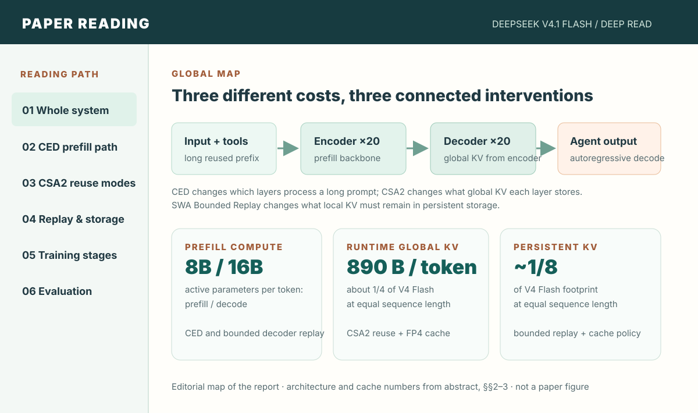
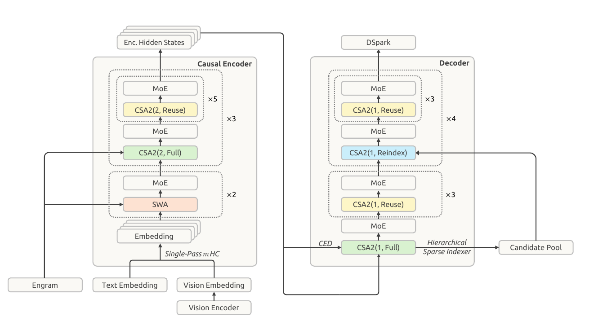
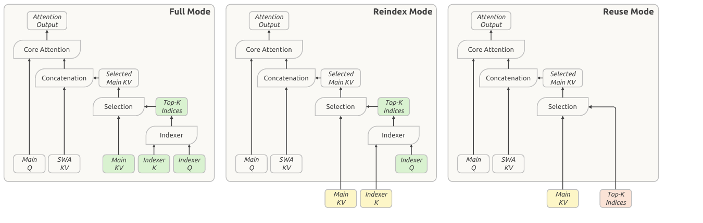

<!-- paper-reading-lang: en -->
# DeepSeek-V4.1-Flash: reading a model through its three memory costs

> **Reading orientation.** Long-running agents repeatedly ingest a large context, decode a small continuation, and reuse prior context after tool calls. The report proposes a model and serving system that attack **prefill computation**, **runtime global KV storage**, and **persistent KV storage** together. This reading uses the [DeepSeek-V4.1-Flash technical report](https://huggingface.co/deepseek-ai/DeepSeek-V4.1-Flash/blob/main/DeepSeek_V41_Tech_Report.pdf) and the corresponding [arXiv text](https://arxiv.org/abs/2609.19969). Benchmark values below are the report's results, not independently rerun measurements. <span class="source-ref">51-page PDF SHA-256: ba68e2e40408125ae6d2f63a9a241b61c73910691c74ec1a2a7023c851eac08d. PDF abstract, §§1–6, Figs. 1, 3–4, Tables 1, 3–4.</span>

```paper-map
{
  "thesis":"For input-heavy agents, model quality is only one axis: reprocessing long prompts and moving their KV states can dominate serving cost.",
  "outcome":"One 40-layer multimodal MoE model combines a cheaper prefill path, cross-layer global KV reuse, lower-precision cache storage, and bounded reconstruction of local state.",
  "outcomeSource":"PDF abstract, §§1–3, Fig. 3",
  "items":[
    {"number":"01","label":"Workload","signal":"long prefix + short turn","text":"Tool use repeatedly brings back a large cached prefix; compute, HBM, SSD or host memory, and transfers all matter.","source":"PDF §1"},
    {"number":"02","label":"Design","signal":"CED + CSA2 + replay","text":"CED changes prefill depth; CSA2 shares global KV and index selections; bounded replay regenerates local SWA state on demand.","source":"PDF §§2.2–2.4, 3.2"},
    {"number":"03","label":"Evidence","signal":"cache accounting + tasks","text":"The report gives cache footprints and benchmark comparisons, with scaffold and reasoning-effort variations that affect interpretation.","source":"PDF abstract, §§4–5, Figs. 1, 9, Tables 1, 3–4"}
  ]
}
```

## 01 / The whole system in one view

The paper's central object is **a model plus its serving path**. The language backbone has 40 layers: a 20-layer causal encoder followed by a 20-layer decoder. It is multimodal, with a vision encoder feeding visual embeddings into the language sequence, and it uses a mixture of experts. The report states 552B backbone parameters plus 196B Engram parameters, while only a fraction of the backbone is active per token. It supports up to a one-million-token context. These are different quantities: total parameters describe model capacity, active parameters affect computation, and KV bytes describe per-token state during serving. (PDF §§1, 2.1, Fig. 3)

The editorial map asks how an agent can reuse long context at lower cost, then links three cost categories to different interventions. **CED** makes a long prompt pass mostly through the encoder and projects decoder global KV from encoder output, reducing active parameters per token during prefill to 8B versus 16B during decode. **CSA2 plus FP4** makes global KV smaller in HBM: the report gives 890 bytes per token, about one quarter of its V4 Flash comparison. **SWA Bounded Replay plus cache policy** lets the server keep less local attention state in persistent storage: about one eighth of the V4 Flash persistent KV footprint at equal sequence length. The ratios describe different stores and cannot be multiplied into one single “32× model compression” claim. (PDF abstract, §§2.2–2.4, 3.2, 6)



*Editorial diagram based on the report's abstract and §§2–3. The arrows show model data flow. Values are reported by the authors; the original architecture appears next.*

The report also contains data curation, training infrastructure, reinforcement learning, agent scaffolds, and evaluations. Those pieces explain how the final checkpoint was obtained and tested; they should not be mistaken for direct evidence that any one cache optimization caused a benchmark gain. (PDF §§3–5)

## 02 / Trace a prompt through CED

The original Figure 3 resolves a question that the cost ratios alone leave open: **what still runs in the decoder?** The figure's left half builds encoder hidden states; the right half reads those states and contains Full, Reindex, and Reuse CSA2 layers. Local sliding-window attention (SWA) still appears in the architecture. Thus “8B active during prefill” does not mean the whole upper half disappears for every token and every operation. (PDF §§2.1–2.2, Fig. 3)



*Original report Fig. 3, PDF p. 7. Read the left block as the 20-layer causal encoder and the right as the 20-layer decoder. “Full”, “Reindex”, and “Reuse” are modes of the global sparse-attention branch, explained in the next section.*

```paper-path
{
  "title":"From a long prompt to an agent continuation",
  "intro":"The path distinguishes long-prefix prefill, cache storage, and short continuation decode; these are separate operating conditions.",
  "stages":[
    {"title":"Embed text and images","role":"input","action":"Text embeddings and vision-encoder outputs are placed in the input sequence; the report uses modality-aware MoE routing corrections.","why":"The model is evaluated on both text and visual tasks, so its input path is part of the reported system.","output":"An ordered multimodal token sequence.","source":"PDF §2.1, Fig. 3"},
    {"title":"Prefill the causal encoder","role":"long-prefix compute","action":"Process a long prompt through the lower 20 layers and produce final encoder hidden states.","why":"Agent turns often have a large prefix but few new tokens; reducing work on that prefix is valuable.","output":"Encoder states and global KV for reuse.","source":"PDF §§1, 2.2, Fig. 3"},
    {"title":"Project decoder global KV","role":"CED bridge","action":"For upper layers, project global KV and compression weights from the final encoder hidden states instead of fully computing each decoder layer across the whole prompt.","why":"The decoder can later attend to prompt information without a full upper-stack prefill on every prompt token.","output":"Decoder global KV; local SWA state still needs preparation.","source":"PDF §2.2, Eq. 1"},
    {"title":"Select context with CSA2","role":"sparse global access","action":"Each layer computes its own query and local SWA KV; the Full, Reindex, or Reuse mode determines which global KV and Top-K selections are newly made or shared.","why":"Sharing across layers reduces cached bytes and some indexer work while permitting selected layers to refresh sparse choices.","output":"Layer output using selected global and local context.","source":"PDF §2.3, Fig. 4"},
    {"title":"Replay local state when needed","role":"serving cache","action":"When local SWA state is absent, recompute only a bounded recent segment and reuse available global KV.","why":"Keeping all local KV persistently is expensive, while exact reconstruction across layers is also costly.","output":"Approximate SWA state for continued generation.","source":"PDF §3.2.2"},
    {"title":"Decode and evaluate","role":"output and measurement","action":"Generate a continuation autoregressively; benchmark the post-trained checkpoint using specified tasks, reasoning effort, and agent scaffolds.","why":"The measured agent score belongs to this full model and evaluation setup, not to a cache component in isolation.","output":"Reported task outcomes under named conditions.","source":"PDF §§5.1–5.3, Tables 3–4"}
  ]
}
```

For a decoder layer $l>L/2$, the report writes its projected global KV and compression weights as follows. Here $H_{L/2}$ is the final encoder hidden state and the $W_l$ matrices are layer-specific; the expression concerns **global** KV, while local SWA keys and values still come from each layer's own hidden state. (PDF §2.2, Eq. 1)

$$
\begin{aligned}
C_l&=H_{L/2}W_l^{KV},\\
Z_l&=H_{L/2}W_l^{Z},\qquad l>L/2.
\end{aligned}
$$

For long sequence length $N$ and SWA window $n_{\mathrm{win}}$, the report compares an $O(NL)$ full-stack prefill with approximately $O(NL/2+n_{\mathrm{win}}L/2)$. The near-halving requires $N\gg n_{\mathrm{win}}$; a short uncached turn can make the replay term more conspicuous. This is a complexity argument, not a measured latency curve for all workloads. (PDF §2.2)

## 03 / Understand what CSA2 shares

The original Figure 4 is the key to **cross-layer reuse**. Its colors have a specific meaning: green means produced by the current layer, yellow means reused main KV or indexer K, and red means reused Top-K indices. All three modes still compute current-layer main Q and SWA KV. Main KV sharing saves storage; Top-K reuse saves indexer computation; Reindex is the middle choice that shares KV but makes a new selection. (PDF §2.3.1, Fig. 4)



*Original report Fig. 4, PDF p. 10. Follow the green blocks across the three panels to see which values are freshly computed in each layer; the yellow and red inputs arrive from an earlier layer.*

| CSA2 mode | Global main KV and indexer K | Top-K indices | Current-layer work that remains |
|---|---|---|---|
| **Full** | New | New | Main Q, SWA KV, indexer Q, scoring and attention |
| **Reindex** | Reused from a Full layer | New | Main Q, SWA KV, its own indexer Q, rescoring and attention |
| **Reuse** | Reused | Reused from a Full or Reindex layer | Main Q, SWA KV and attention |

The global branch uses a sparse indexer to select main KV entries, then combines those selected entries with local SWA KV. A hierarchical indexer first searches broadly in a Full layer and supplies a candidate pool for later Reindex layers. The report's example pool has 2,048 blocks of eight positions, or 16,384 positions, before selecting Top-512. Later Reindex search can then have a bounded candidate domain; **the initial Full search still sees the full history**. CSA2 also removes overlapping compressor inputs and absolute position embeddings used in its predecessor and derives indexer K from main KV. (PDF §§2.3–2.3.2)

The cache number is best read in this precise form: **890 bytes of runtime global KV per token**, always in HBM in the reported deployment accounting, about **one quarter of DeepSeek-V4-Flash** at the same sequence length. It comes from the joint CSA2 design and FP4 main-KV storage; the report does not give a controlled table here that lets this reading allocate a unique fraction of the 4× reduction to each component. FP4 means the cache's main KV entries are stored at low precision; the model's weights and every cache component are not all thereby “FP4”. (PDF abstract, §§2.3–2.4.4, Fig. 1b)

## 04 / Separate runtime cache from persistent cache

Runtime KV in HBM supports the active sequence. Persistent KV on SSD or host memory allows a prior prefix to be reused after an agent's next tool call. SWA's local state is bounded in sequence length but large across layers and expensive to retain for many sessions. In the previous deployment, SWA KV consumed nearly half of persistent cache capacity; the report's new policy keeps long-lived global KV persistently while putting short-lived SWA KV into a host-memory pool with a minute-scale TTL. A miss triggers bounded reconstruction. (PDF §§1, 3.2.1)

**Why replay is approximate.** To exactly reconstruct local state after dependencies have passed through $L$ layers, the paper says one would need roughly $L n_{\mathrm{win}}$ tokens of replay. Bounded replay uses only the most recent $n_{\mathrm{win}}$ tokens and truncates local attention at the replay start $s$. For a query at position $i$ and SWA width $W$, the available local keys are: (PDF §3.2.2)

$$
\left[\max\!\left(s,\,i-W+1\right),\;i\right].
$$

This makes reconstructed local state depend on the cache-hit point. Encoder replay reuses cached global KV while rebuilding missing SWA KV; decoder replay runs the recent segment through decoder layers to prepare local state for the first decode steps. The authors report little observed quality loss and simulate replay during post-training, but the reconstructed state is **not mathematically identical** to full-history execution. At equal sequence length, the combined serving design reports a **persistent KV footprint around one eighth** of V4 Flash. That ratio covers a different cache tier from 890 B/token. (PDF §§3.2.1–3.2.2, 6)

## 05 / How the checkpoint was trained

Architecture explains the cost path; training explains why the final checkpoint can be useful. The report describes 45T multimodal pretraining tokens, with sparse attention trained from scratch at a 64K sequence length rather than introduced after a dense-attention warmup. The model's one-million-token supported context is a serving capability claim; it should not be confused with a claim that all pretraining ran at one million tokens. (PDF §§1, 4.1–4.2)

The full system also includes Single-Pass mHC, Engram memory, DSpark, multimodal routing and vision components. Figure 3 shows where several of them attach, while §§2.4 and 3 describe their design and infrastructure. Their presence matters because the final model is a package of changes: performance differences against V4 Flash cannot be attributed solely to CED, CSA2, FP4, or replay without component-specific controls. (PDF §§2.1, 2.4, 3, Fig. 3)

Post-training follows **SFT → RL → on-policy distillation**. The paper describes synthesized agent tasks as a problem, an executable environment, and a verifier; asynchronous RL supports long agent rollouts, and the final distillation stage uses many domain teachers. It explicitly frames the post-training advance mainly as data and environment scale rather than a novel RL objective. This matters when connecting architecture to Table 3: the latter measures the resulting checkpoint after this entire training pipeline. (PDF §5.1–5.2)

## 06 / Read the experiments by question and condition

```paper-experiments
{
  "title":"What each reported result can answer",
  "rows":[
    {"question":"How small is the serving state?","setup":"Compare per-token global runtime KV and equal-length persistent KV against DeepSeek-V4-Flash under the report's deployment accounting.","observation":"Global KV: 890 B/token, about 1/4 of V4 Flash. Persistent KV: about 1/8. These are two different storage tiers and the integrated design includes several changes.","source":"PDF abstract, §§1, 3.2, Fig. 1b"},
    {"question":"Does the final model improve on its predecessor in code-agent tasks?","setup":"Table 3 compares post-trained V4 Flash and V4.1 Flash using the report's named benchmark versions and harnesses.","observation":"Terminal-Bench 2.1 Pass@1: 82.7→90.6; DeepSWE v1.1 resolved: 54.4→74.2; NL2Repo score: 54.2→65.4. The difference is whole-system performance, not a cache ablation.","source":"PDF §5.3.1–5.3.2, Table 3"},
    {"question":"Does an agent score depend on its scaffold?","setup":"Table 4 fixes the V4.1 checkpoint and task sets, varying agent scaffolds at Max reasoning effort; DeepSWE uses eight samples per task and Terminal-Bench 2.1 uses three.","observation":"DeepSWE resolved ranges from 65.5 with OpenCode to 74.2 with mini-SWE; Terminal-Bench 2.1 ranges from 84.1 with Codex to 90.6 with DeepSeek Harness Minimal. A score needs its harness attached.","source":"PDF §5.3.4, Table 4, Appendix B.1"},
    {"question":"How does reasoning effort trade tokens for quality?","setup":"Figure 9 varies effort 25–100 on reasoning and agent tasks while also plotting mean output length.","observation":"The eight-task reasoning average rises 67.1%→76.3%; DeepSWE 66.0%→74.2%; Terminal-Bench 2.1 82.4%→90.6%, with roughly 2.5× more output tokens. These are the paper's setting-specific trade-offs.","source":"PDF §5.3.2–5.3.3, Fig. 9"}
  ]
}
```

**Selected Table 3 values.** Every cell below is a report value in percent except NL2Repo's score. The V4 Flash and V4.1 Flash columns are the comparison relevant to this paper; the table includes other models, but their harnesses and reporting details must be checked before treating all rows as an identical controlled experiment. (PDF §5.3, Table 3)

| Benchmark and metric | V4 Flash | V4.1 Flash | How to read it |
|---|---:|---:|---|
| GPQA Diamond Pass@1 | 89.9 | 90.9 | Reasoning accuracy, a one-point rise |
| Terminal-Bench 2.1 Pass@1 | 82.7 | 90.6 | Code agent; V4.1 uses DeepSeek Harness Minimal |
| Terminal-Bench 3.0 Pass@1 | 7.6 | 30.0 | A different, much harder version of the benchmark |
| Terminal-Bench 4.0 Pass@1 | 7.0 | 31.2 | Another benchmark version; not interchangeable with 2.1 |
| DeepSWE v1.1 resolved | 54.4 | 74.2 | V4.1 evaluation uses mini-SWE |
| NL2Repo-Bench score | 54.2 | 65.4 | Repository task score, not a percentage of cache saved |
| CyberGym Pass@1 | 76.7 | 88.1 | Cybersecurity agent evaluation |
| AutomationBench Pass@1 | 37.7 | 54.8 | Official scaffold for this task |

The setup is part of the result. For code agents, the report evaluates V4.1 with DeepSeek Harness Minimal, a one-million-token window, temperature 1.0, and top-p 0.95, except DeepSWE uses mini-SWE. Visual tasks use Claude Code with a 512K window; AutomationBench uses its official scaffold. Table 4 isolates **scaffold variation for the same V4.1 model**: DeepSWE is 74.2 with mini-SWE, 69.8 with Claude Code, and 65.6 with Codex; Terminal-Bench 2.1 is 90.6 with DeepSeek Harness Minimal, 90.3 with mini-SWE, and 84.1 with Codex. These within-model differences are why a headline agent number should always carry its harness, effort, sample count, and benchmark version. (PDF §5.3.1, §5.3.4, Tables 3–4)

## 07 / What the evidence establishes

The architecture and cache accounting make a coherent engineering argument: long-prefix prefill can skip much of the decoder's full computation, CSA2 can reuse global state across layers, FP4 can shrink main KV entries, and bounded replay can avoid long-lived local SWA storage. The report supplies an explicit architectural path and concrete global and persistent KV footprint ratios. Its task tables show that the **complete trained system** performs well under the specified evaluations. (PDF abstract, §§2–5)

Two limits follow from that same evidence. First, the reported predecessor comparison changes model size, architecture, training data, post-training, and serving choices together; it does not isolate a single component's contribution to Table 3. Second, bounded replay deliberately reconstructs approximate local state. The authors report small observed quality effects, while also naming selection errors in CSA2 and possible degradation on untested boundary cases as future concerns. The defensible reading is a strong integrated systems result with clear workload assumptions, not a universal latency or quality guarantee for every deployment. (PDF §§3.2.2, 5–6)
