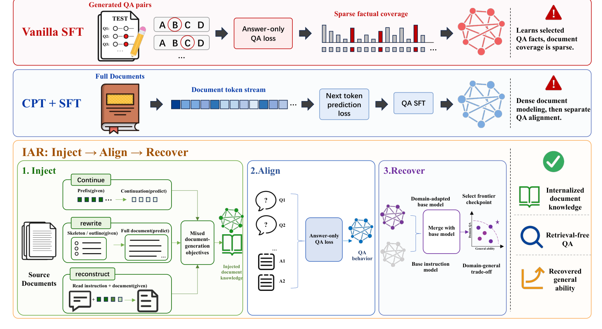
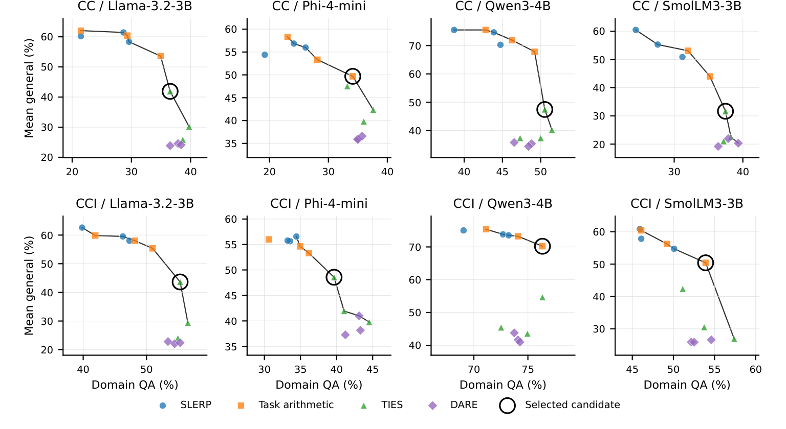
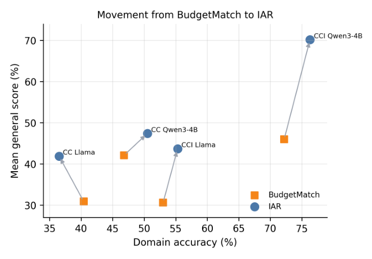
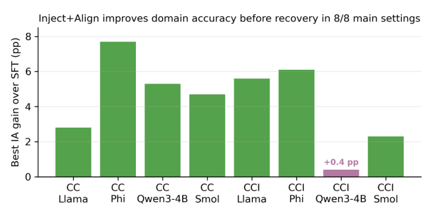

<!-- paper-reading-lang: zh-CN -->
<!-- paper-reading-theme: plum -->
# IAR：把文档“注入”参数，再把通用能力“找回来”

> **阅读定位**：RAG 是文档问答的标准工程答案，但许多部署里检索不可用、不想要（延迟/隐私），或者被故意拿掉，以检验后训练是否改变了模型的参数化知识。这篇论文研究**文档知识内化**（document knowledge internalization）：把一个有界语料库变成可用的参数知识，推理时只看问题、不看原文。作者提出三阶段框架 IAR（Inject → Align → Recover），并用一组刻意分开的对照实验回答：密集文档暴露、QA 对齐、能力恢复各自贡献了什么。原文为 Qian Kou、Xiaofeng Shi（共同一作/共同通讯）、Xiaosong Qiu、Hua Zhou 的 *Inject, Align, Recover: Staged Post-Training for Retrieval-Free Document Knowledge Internalization*（BAAI）。<span class="source-ref">本图谱依据 arXiv:2608.20281v1（2026-08-20）PDF，共 21 页：正文 §§1–7 + 补充材料 A–G；Figs. 1–4；Tables 1–28。</span>

## 01 / 全局：无检索问答的三道坎

**一句话主线：** 把语料内化进参数，难点不在“学没学”，而在三件事会互相打架——QA 监督覆盖太稀、文档级训练接不上 QA 接口、领域适应会碰坏通用能力；IAR 把三件事拆成三个阶段分别干预，再用受控对照证明每一步的贡献。（PDF §§1, 3）

问题的设置比 RAG 苛刻：训练用文档派生的 QA 对，测试时模型**只收到问题**，没有任何检索段落。三条最直接的路线各有一个缺口（PDF §1）：**Vanilla SFT** 让模型学会测试时的输入输出格式，但学习信号稀疏——只有被 QA 生成器选中的事实进入损失；**续训（CPT）** 提供密集的文档暴露，却不教模型怎么回答问题；而两条路线都面临**灾难性遗忘**——领域变强、指令遵循和通用基准变弱。

IAR 把这三个缺口变成三个可检验假设，并各配一个阶段（PDF §3“Why Three Stages?”）：**Inject** 检验“更密的文档级监督是否有用”（不是原始续训，而是指令化的文档重构任务）；**Align** 检验“注入的知识能否通过 QA 接口取出来”（answer-only 监督）；**Recover** 检验“适应后的模型能否向原始指令模型回移、找回通用能力”（事后权重合并 + 验证集选点）。论文特意强调：这是**实验分解**而非单一秘方——某一阶段的负结果不波及其他阶段，强 SFT 基线只是“同一种适应预算的另一种花法”。（PDF §3）

```paper-map
{
  "thesis":"无检索文档内化的难点是三个互相耦合的缺口：QA 覆盖稀疏、文档暴露接不上 QA 接口、领域适应碰坏通用能力。IAR 把三者拆成 Inject/Align/Recover 分别干预。",
  "outcome":"在 8 个数据集-模型设置中的 7 个，IAR 在全部四项指标上同时优于 Vanilla SFT：领域 QA 平均 +3.6 点，通用三项（IFEval/MMLU/MSBench）均值平均 +12.1 点。",
  "outcomeSource":"PDF 摘要, §5, Table 1",
  "items":[
    {"number":"01","label":"问题","signal":"检索被拿掉","text":"推理时只有问题、没有原文。SFT 信号稀疏，CPT 不接 QA 接口，两者都会遗忘通用能力。","source":"PDF §1"},
    {"number":"02","label":"机制","signal":"三阶段分解","text":"Inject：续写/改写/指令化重构三类文档生成目标；Align：answer-only QA 监督；Recover：与基模型做事后合并并按领域优先前沿规则选点。","source":"PDF §§3.1–3.3, Fig. 1"},
    {"number":"03","label":"证据","signal":"分离的对照","text":"RQ1 主表（4 模型 × 2 语料）、RQ2 token 预算对照（BudgetMatch）、RQ3 恢复前的 IA 增益、RQ4 Qwen3-8B/14B/32B 缩放，外加 SDFT/LoRA/Replay/FAPM 扩展基线。","source":"PDF §§4–5, Tables 1–3, 21–27"}
  ]
}
```

**核心结果速览（Table 1 主比较）：** CC 语料上，IAR 对四个模型家族在领域准确率和三项通用指标上全胜 Vanilla SFT；CCI 上，Llama、Qwen3-4B、SmolLM3 同样全胜，Phi 是边界情形（IFEval、MSBench 更好，领域与 MMLU 略降）——合计 8 个设置中 7 个全指标胜出。最亮的单点：Qwen3-4B CC 领域准确率 50.5% 对 Vanilla 的 42.4%，同时三项通用指标全部更高。（PDF §5.1, Table 1）

**原论文 Fig. 1 把 IAR 与两条对照路线画在同一版面上，建议对比着读：** 上两条横带是 Vanilla SFT（QA 对 → answer-only 损失 → 事实覆盖稀疏，红色警示）和 CPT+SFT（原文 token 流 → next-token 损失 → 再单独 QA 对齐）；下面的大框是 IAR 三阶段——Inject 的三种文档生成目标（continue 给前缀续写后缀、rewrite 从骨架/大纲重构全文、reconstruct 凭阅读指令重构全文），Align 的 answer-only QA 损失，以及 Recover 的“与基模型合并 → 在领域-通用平面上选前沿点”。右侧三个图标是最终交付物：内化的文档知识、无检索 QA、找回的通用能力。（PDF p. 2, Fig. 1）



*原论文 Fig. 1。<span class="source-ref">PDF p. 2.</span> 注意作者的自述：IAR 不声称发明了新的重构损失，它的增量是“受控的实验分解”。*

## 02 / 三阶段机制：每一步到底做什么

```paper-path
{
  "title":"从原始文档到可部署的无检索 QA 模型",
  "intro":"三个阶段解决三个不同问题；Recover 的选点规则决定最终交付的是哪个检查点，而不是领域分最高的那个。",
  "stages":[
    {"title":"Inject：指令化文档注入","role":"把语料变成密集的监督目标","action":"把清洗后的文档转成三类助手目标损失任务：Continuation（给指令化前缀、预测后缀）、Rewrite（给生成的摘要/大纲/知识骨架、重构完整文档）、指令化重构（给通用阅读指令、重构完整文档）；按整数配比混合（如 1:0:0、1:1:1、1:1:2），提示词 token 全部掩码。","why":"QA 对只覆盖文档事实的一个子集；指令化重构既提供密集暴露，又保留指令-目标边界，不同于没有 QA 接口的原始 token 流 CPT。","output":"注入了文档知识的检查点 θI。","source":"PDF §3.1, Eq. 1, Table 7；附录 B"},
    {"title":"Align：answer-only QA 对齐","role":"把知识接到问答接口上","action":"在文档派生 QA 对上做 answer-only SFT（Eq. 3），从注入检查点 θI 出发得到 θIA；对照组 Vanilla SFT 从原始指令模型 θ0 出发（Eq. 4）。","why":"文档级训练不等于会答题；这一阶段检验注入的知识能否在 QA 接口下被“取出来”。","output":"恢复前的领域适应检查点 θIA（Best IA）。","source":"PDF §3.2, Eqs. 3–4"},
    {"title":"Recover：事后合并恢复","role":"找回被适应碰坏的通用能力","action":"计算任务向量 Δ = θIA − θ0，用 SLERP/Task Arithmetic/TIES/DARE 四族共 12 个固定候选做合并（Eq. 5）；在验证集上按“领域优先前沿”规则选点（τ = 1 个百分点）：先保证领域分不低于 Vanilla −τ，再要求通用均值不低于 Vanilla 且三项中至少两项不逊于 Vanilla −τ，最后在非支配候选里按领域分层、层内取通用均值最大者。","why":"合并把适应“调回”基模型方向，部分恢复遗忘的通用能力；选点规则在测试前固定，使报告的操作点可审计而非事后搜索。","output":"最终 IAR 检查点（Table 16 记录每个设置选中的算子与系数）。","source":"PDF §§3.3, 4.1, E；Tables 15–16"}
  ]
}
```

### Inject 与 CPT 的分界线：损失写在哪个接口上

Inject 的损失（Eq. 1）把每种目标 $m$ 的样本视为“指令 $u$ + 文档目标 $y$”的监督对，按**经验采样份额** $\pi_m$ 混合（$\pi_m$ 是实际行数占比，不是自由损失系数），且只对助手目标 $y$ 计损：

$$
\mathcal{L}_{\mathrm{inj}}=\sum_{m\in\mathcal{M}}\pi_m\,\mathbb{E}_{(u,y)\sim\mathcal{D}_m}\big[\ell_\theta(u,y)\big],\qquad \ell_\theta(u,y)=-\frac{1}{|y|}\sum_{t=1}^{|y|}\log p_\theta(y_t\mid u, y_{<t})
$$

而原始续训（Eq. 2）直接对文档流做 next-token 预测，$\mathcal{L}_{\mathrm{CPT}}=-\frac{1}{T}\sum_t\log p_\theta(x_t\mid x_{<t})$，**没有指令-目标边界，也没有 QA 接口**。论文特别说明：配比标签 1:0:0 指“带阅读提示的纯重构 Inject”，不要与原始 CPT 基线混淆。（PDF §3.1, Eqs. 1–2；附录 B, Table 7）

```paper-contrast
{
  "title":"同样是密集文档暴露：原始续训（CPT）与指令化注入（Inject）",
  "intro":"两者都给模型比 QA 更密的文档接触；区别在于监督写在原始 token 流上，还是写在指令-目标边界上。",
  "branches":[
    {"name":"CPT + SFT","lead":"先对原文 token 流做 next-token 预训练，再单独做 QA SFT。","scope":"常规 dense-document 基线；主表从对应 Base 检查点出发。","judge":"文档建模与问答接口分离，知识可能“在参数里却答不出来”。","signal":"主表中 CPT+SFT 通用指标大幅塌陷（如 Llama CC：IFEval 26.4、MMLU 3.7），域内提升有限。","why":"原始流没有指令-目标边界，也无 QA 行为约束；且 Base 初始化与 IAR 的 Instruct 初始化不同，不能单独归因于目标形式（Table 23 的 Instruct-CPT 诊断另行列出）。","source":"PDF §§3.1, 4.2, Table 1；附录 G"},
    {"name":"Inject（IAR 阶段一）","lead":"续写、改写、指令化重构三类助手目标损失任务。","scope":"从指令模型出发，提示词掩码，只对文档目标计损。","judge":"密集暴露与指令接口同时保留：模型在“按指令产出文档内容”中接触全部事实。","signal":"RQ3：恢复前 Best IA 在 8/8 设置上领域准确率超过 Vanilla SFT（+0.4 至 +7.7 点）。","why":"作者机制主张：结构化文档暴露在合并恢复之前就贡献了可测量的领域信号；但最优配比随模型与语料而变，论文不支持“万能配比”。","source":"PDF §5.3, Fig. 3, Tables 26–27"}
  ]
}
```

### Recover 的选点规则：交付的不是“领域最高”

恢复阶段把任务向量 $\Delta=\theta_{\mathrm{IA}}-\theta_0$ 用 $\theta_R=\theta_0+\lambda\Delta$ 的形式回调（Eq. 5），从固定的 12 候选网格（SLERP $t\in\{0.2,0.3,0.4\}$、Task Arithmetic $w\in\{0.3,0.5,0.7\}$、TIES $d\in\{0.3,0.5,0.7\}$、DARE $dr\in\{0.1,0.3,0.5\}$）中选一个。选择发生在**验证集**上、测试集评估之前，规则为（τ = 1 个百分点）：① 领域可行——$D(c)\geq D(v)-\tau$（$v$ 为 Vanilla SFT）；② 通用护栏——$G(c)\geq G(v)$ 且 IFEval/MMLU/MSBench 中至少两项不低于 Vanilla $-\tau$；③ 领域优先分层——非支配候选中，与最优领域分相差 $\tau$ 以内者属同一层；④ 层内取 $G(c)$ 最大者，再按最小通用改进、同族较小系数打破平局。（PDF §4.1；附录 E）

**教学算例（本图谱自造，非论文实验）：** 设三个非支配候选 $(D,G)$ 为 $(50.5,\,47.4)$、$(50.3,\,49.0)$、$(48.0,\,55.0)$，$\tau=1.0$。领域最高层是 $\{50.5, 50.3\}$（与 50.5 差 ≤1.0），$(48.0,\,55.0)$ 虽然通用最强却不在层内；规则在层内取 $G$ 最大者，选中 $(50.3,\,49.0)$——它既不是领域最高点，也不是通用最高点，而是“领域优先、通用决胜”的前沿操作点。论文 Table 16 显示实际选中：CC 上三个模型选 TIES $d{=}0.3$、Phi 选 Task Arithmetic $w{=}0.7$；CCI 上 Llama/Phi 选 TIES、Qwen/SmolLM 选 Task Arithmetic。（PDF 附录 E, Table 16）

**原论文 Fig. 4 把这套选择画成了 8 张前沿散点图**（每个数据集-模型设置一幅）：横轴领域 QA、纵轴通用均值，四种颜色/形状对应四族算子，黑线是非支配前沿，黑圈是验证协议选中的候选。三个值得注意的模式：SLERP（蓝）与 Task Arithmetic（橙）沿前沿分布；DARE（紫菱）成片沉在通用低端；被选中的黑圈永远站在“领域几乎不亏、通用大幅高于底部”的前沿拐角上——这正是 τ=1 分层规则的几何含义。图中展示的是测试集表现，但仅作诊断，选择早在验证集上完成。（PDF p. 16, Fig. 4；附录 E）



*原论文 Fig. 4。<span class="source-ref">PDF p. 16.</span> 注意 CC 四个面板的领域轴在 20–50%、CCI Qwen 面板在 70–75%——高起点设置的“前沿”形态完全不同，对应 04 节的边界讨论。*

## 03 / 数据与评测：分数从哪来、能信到哪

**QA 对是怎么造出来的。** CC（源自 Common Corpus）与 CCI（源自 CCI4.0 系列）使用同一条 anchor-aware 流水线：先从文档块抽取可独立指称的锚点（禁止“该方法”“上述机制”这类回指表达），判断题型适用性，生成自足问题（必须显式命名锚点、脱离原文可懂、禁用“根据原文”），校验后再用同一文档块生成 grounded 答案。测试时模型只收到问题——这是比 RAG 更严格的契约。（PDF §4.2；附录 A–B, Tables 4–5）

**数据规模账目（附录 B, Table 6）：** CC 从 4,001 个输入文档出发，文件级过滤掉 48.6%，最终实验用 QA 15,008 条（14,258 训练 + 750 测试）；CCI 从 7,000 个文档出发（仅滤掉 4.4%），最终 11,501 条（10,926 + 575）。作者坦白了两点：两个语料的过滤路径不同，阶段比率只能刻画数据流、不能直接当“数据集质量分”横向比较；这些机器检查（重复、回指、答案-原文重叠）**不能替代人工验证**。（PDF 附录 B, Table 6）

**评审面板与其可靠性审计（附录 D）：** 领域 QA 用自适应 LLM 评审——两名评委先各自按 $\{0,\,0.5,\,1\}$ 打分（1=核心结论正确，0.5=大体正确但不完整/有瑕疵，0=错误或矛盾），分歧时叫第三名，取中位数；评委组合包括 gpt-oss-120b、MiniMax-M2.5、DeepSeek-V3 系列。作者没有把这当作金标准，而是做了全量审计：343 个结果文件、242,255 条答案记录，前两名评委完全一致率 .707、按 ≥.5 折算的二值一致率 .848、Cohen's $\kappa=.691$、第三名触发率 .297。通用侧：IFEval 与 MMLU 走规则/答案键，MSBench 用固定 200 例子集（来自公开的 iic/ms_bench）加 LLM 评审。每个结果文件配 2,000 次 bootstrap 重采样给出评测采样不确定区间——但论文明言这**不覆盖训练种子鲁棒性**：所有检查点都是单次训练、生成与评审无固定采样种子。（PDF §4.3；附录 C–D, Tables 12–14）

**读这份评测的正确姿势（读者视角）：** 领域分和 MSBench 分都是“评审产出的测量值”，不是答案键标签；κ=.691 说明评委间只是实质性一致而非高度一致，小幅分差（如 ±1 点以内）不宜过度解读——这也正是论文把 τ 设为 1 个百分点、把边界情形写进主表的原因之一。（对应 PDF §4.3、附录 D）

## 04 / 实验图谱：四个研究问题各自回答什么

```paper-experiments
{
  "title":"每个实验能回答的问题",
  "rows":[
    {"question":"RQ1：IAR 是否改善领域-通用操作点？","setup":"Table 1：4 个模型家族 × CC/CCI 两个语料，对照 Base Instruct、Vanilla SFT、Base 初始化的 CPT+SFT；同一评审协议。","observation":"CC 上 IAR 对全部四个家族在四指标上全胜 Vanilla；CCI 上 Llama/Qwen/SmolLM 全胜，Phi 为边界（IFEval 51.6 vs 47.8、MSBench 44.0 vs 31.5 更好，领域 39.7 vs 40.2、MMLU 50.2 vs 53.8 略降）。合计 7/8 设置全指标胜出；平均 +3.6 点领域、+12.1 点通用均值。Qwen3-4B CC 最亮：42.4→50.5 且三项通用全部更高。这是整系统比较，归因要靠 RQ2–RQ4。","source":"PDF §5.1, Table 1"},
    {"question":"RQ2：增益是否只是“多训了 token”？","setup":"Table 2：BudgetMatch 用与 Inject+Align 等 token 量的纯 QA 训练（14/17/21/11 epoch）；对照 Vanilla 与 IAR。","observation":"BudgetMatch 在 CC 上确实变强（领域 +4.9/+4.4），但 CCI Llama 基本不变、CCI Qwen 反降 2.9 点。IAR 相对 BudgetMatch：4 个设置中 3 个领域更高、4 个通用均值全部更高；16 项指标比较赢 14 项（例外：CC Llama 领域、CC Qwen MMLU）。CC Llama 是真正的权衡点：IAR 用 3.9 点领域换 11.0 点通用。结论：token 分配解释 CC 的一部分增益，解释不了分阶段暴露+恢复带来的操作点。","source":"PDF §5.2, Table 2, Fig. 2"},
    {"question":"RQ3：Inject+Align 在恢复之前有没有独立贡献？","setup":"Fig. 3 与 Tables 26–27：恢复前 Best IA 与 Vanilla SFT 的领域对比，覆盖 8 个设置与 5 种配比。","observation":"8/8 设置 Best IA 全胜 Vanilla：CC +2.8/+7.7/+5.3/+4.7，CCI +5.6/+6.1/+0.4/+2.3。最优配比不统一：Llama/Phi 偏好 Mixed 1:1:2，Qwen3-4B CC 偏好 1:1:1，CCI 偏好纯重构 1:0:0。论文因此只主张“结构化暴露有可测量贡献”，不主张万能配方。","source":"PDF §5.3, Fig. 3, Tables 26–27"},
    {"question":"RQ4：恢复模式在更大模型上是否复现？","setup":"Table 3：Qwen3-8B/14B/32B on CC，同选 TIES d=0.3；与 Base/Vanilla/Best IA 对照。","observation":"IAR 领域分保持在 Best IA 的 1.1 点以内（代价 0.7/0.9/1.1），通用均值提升 +14.9/+24.1/+17.8 点，且三项基准各自都涨（如 32B：IFEval +14.0、MMLU +11.5、MSBench +28.0）。Best IA 相对 Vanilla 仍有 +8.8/+5.7/+7.5 领域增益——恢复不是“白捡”，适应与恢复两段的贡献都可见。但恢复是部分的：通用分没有全面回到原始模型水平；且三行同属 CC+同一密度，论文只声称“族内重复模式”，不声称缩放定律。","source":"PDF §5.4, Table 3"},
    {"question":"扩展基线压力测试：IAR 是否被别的方法取代？","setup":"Tables 21–22（CC-only）：SDFT、LoRA、Replay、FAPM 与 IAR 同协议比较。","observation":"SDFT 是强数据配方基线（Llama CC 领域 39.9 > IAR 36.5，IAR 仅在此居第二）；LoRA 与 FAPM 常保住更强的单项通用指标（如 Qwen：FAPM IFEval 83.8/MSBench 85.0 远高于 IAR 59.8/63.0），但领域内化明显落后。IAR 在 Phi/Qwen/SmolLM 上领域最佳。正确读法：IAR 是强“领域优先”操作点，不是全指标碾压。","source":"PDF §5.1, Tables 21–22；附录 G"},
    {"question":"剪枝式恢复（FAPM）与合并式恢复差在哪？","setup":"Tables 24–25：FAPM 在稀疏度 0.9 下保留任务向量前 10% 条目，分别作用于 Vanilla（Vanilla-FAPM）与 IA（IA-FAPM）检查点。","observation":"FAPM 的通用恢复确实好，但领域列暴露代价：CC Llama 35.5→22.3，CCI Qwen 75.1→68.9——剪枝把内化的文档知识一起剪掉了。它回答了“为什么 FAPM 不是 IAR 的即插即用替代”：两者优化的是不同的操作点。","source":"PDF 附录 G, Tables 24–25"}
  ]
}
```

**主表精选（Table 1，单位 %）：** 每格为“领域 / IFEval / MMLU / MSBench”。读法：先看 Vanilla SFT 相对 Base 的遗忘幅度（通用三项齐跌），再看 IAR 拉回来多少、领域付出什么。（PDF §5.1, Table 1）

| 设置 | Vanilla SFT | IAR | 读数 |
|---|---|---|---|
| CC · Llama-3.2-3B | 35.5 / 54.2 / 11.2 / 21.5 | **36.5 / 60.2 / 35.0 / 30.5** | 四指标全胜；MMLU +23.8 |
| CC · Phi-4-mini | 24.4 / 47.8 / 51.0 / 32.5 | **34.1 / 49.0 / 57.0 / 43.0** | 领域 +9.7，最大单点涨幅 |
| CC · Qwen3-4B | 42.4 / 51.1 / 8.8 / 51.0 | **50.5 / 59.8 / 19.5 / 63.0** | 论文点名的最清晰案例 |
| CC · SmolLM3-3B | 32.1 / 35.6 / 10.5 / 25.0 | **37.5 / 40.3 / 25.7 / 29.0** | 四指标全胜 |
| CCI · Llama-3.2-3B | 53.0 / 61.2 / 22.5 / 31.5 | **55.3 / 61.3 / 33.2 / 36.5** | 四指标全胜 |
| CCI · Phi-4-mini | **40.2** / 47.8 / **53.8** / 31.5 | 39.7 / **51.6** / 50.2 / **44.0** | **边界**：通用两项大涨，领域 −0.5、MMLU −3.6 |
| CCI · Qwen3-4B | 75.1 / 45.6 / 26.3 / 49.5 | **76.3 / 76.1 / 64.5 / 70.0** | 高起点（Base 已 70.6）仍全胜，通用均值 +29.7 |
| CCI · SmolLM3-3B | 52.3 / 41.7 / 16.7 / 31.5 | **53.9 / 57.4 / 46.8 / 47.0** | 四指标全胜 |

*依据原论文 Table 1 重排。<span class="source-ref">PDF p. 6.</span> 加粗为该设置占优方；CCI Phi 行刻意保留在主表，说明“恢复”不承诺均匀支配。*

```paper-chart
{"type":"paired","title":"Vanilla SFT → IAR：通用三项的恢复幅度（CCI · Qwen3-4B）","subtitle":"单位：%；该设置通用均值 +29.7 点","origin":"本文重绘 · 原论文 Table 1","note":"同一检查点在同一评测协议下的四指标对照。","source":"PDF p. 6, Table 1","rows":[{"label":"IFEval","before":45.6,"after":76.1},{"label":"MMLU","before":26.3,"after":64.5},{"label":"MSBench","before":49.5,"after":70.0}]}
```

```paper-chart
{"type":"paired","title":"Vanilla SFT → IAR：领域准确率（CC 四家族）","subtitle":"单位：%","origin":"本文重绘 · 原论文 Table 1","note":"领域增益的同时三项通用指标也全部提高（见上表），这是 IAR 操作点的含义。","source":"PDF p. 6, Table 1","rows":[{"label":"Llama-3.2-3B","before":35.5,"after":36.5},{"label":"Phi-4-mini","before":24.4,"after":34.1},{"label":"Qwen3-4B","before":42.4,"after":50.5},{"label":"SmolLM3-3B","before":32.1,"after":37.5}]}
```

**原论文 Fig. 2 用一张散点图总结 RQ2：** 横轴领域准确率、纵轴通用均值，每个箭头从 BudgetMatch（橙方块）指向 IAR（蓝圆点）。三个箭头向右上走（CCI Qwen 最陡：通用从约 46 拉到约 70），只有 CC Llama 向左下走——这就是论文说的“3/4 上移右移，CC Llama 是真实权衡”。箭头比表格更直观地说明：IAR 的增益模式随语料而变，不是统一平移。（PDF p. 5, Fig. 2）



*原论文 Fig. 2。<span class="source-ref">PDF p. 5.</span>*

**原论文 Fig. 3 是 RQ3 的证据主体：** 八根柱子是恢复前 Best IA 相对 Vanilla SFT 的领域增益（pp），7 根绿柱、1 根粉紫短柱——唯一的小增益（+0.4）是 CCI Qwen3-4B，即“高起点边界”：原始指令模型在该语料上已有 70.6% 领域分，注入可提升的余量天然有限。附录 F 的 BPB 诊断给出旁证：Qwen3-4B 对 CCI 源文本的条件 bits-per-byte 低于全部三个同侪（配对 95% 区间全为负），与“更强的语料先验”一致——但作者明确限定：这**不能证明**记忆、数据重叠或污染，也不能解释因果。（PDF §5.3, Fig. 3；附录 F, Table 17）



*原论文 Fig. 3。<span class="source-ref">PDF p. 6.</span>*

**RQ4 缩放表（Table 3，CC，单位 %）：** 三个尺寸都重复同一签名——领域微降（≤1.1 点）、通用大涨。注意最后一行对照：恢复后的通用分仍低于 Base Instruct，论文据此强调“恢复是部分的”。（PDF §5.4, Table 3）

| 模型 | 方法 | 领域 | IFEval | MMLU | MSBench |
|---|---|---:|---:|---:|---:|
| Qwen3-8B | Base Instruct | 38.5 | 87.6 | 65.3 | 82.5 |
| Qwen3-8B | Vanilla SFT | 48.7 | 56.4 | 14.0 | 52.5 |
| Qwen3-8B | Best IA | 57.5 | 50.6 | 18.5 | 48.5 |
| Qwen3-8B | IAR (TIES d=0.3) | 56.8 | 62.2 | 26.7 | 73.5 |
| Qwen3-14B | Base Instruct | 40.4 | 90.0 | 72.5 | 81.5 |
| Qwen3-14B | Vanilla SFT | 54.8 | 62.9 | 54.5 | 57.0 |
| Qwen3-14B | Best IA | 60.5 | 53.5 | 40.3 | 42.0 |
| Qwen3-14B | IAR (TIES d=0.3) | 59.6 | 67.5 | 67.2 | 73.5 |
| Qwen3-32B | Base Instruct | 47.2 | 87.5 | 74.8 | 84.5 |
| Qwen3-32B | Vanilla SFT | 56.4 | 58.5 | 44.0 | 56.5 |
| Qwen3-32B | Best IA | 63.9 | 53.0 | 63.0 | 44.5 |
| Qwen3-32B | IAR (TIES d=0.3) | 62.8 | 67.0 | 74.5 | 72.5 |

*原论文 Table 3。<span class="source-ref">PDF p. 7.</span> 另注意论文的来源诚实声明：三个缩放行的原始 Inject/Align 训练日志不在档案中，作者拒绝推断其超参，Table 8 的公共配置不覆盖这三行。（PDF 附录 C）*

## 05 / 综合：分解为什么有效，边界在哪里

这篇论文的价值不止是一个更好的分数，而是**把“适应预算”拆成了可审计的三份**。RQ2 证明 token 量本身只解释一部分（CC 的 BudgetMatch 有效、CCI 失效）；RQ3 证明结构化暴露在恢复之前就有独立领域贡献（8/8 为正），但配比要按模型和语料调；RQ4 证明适应与恢复在更大模型上仍然可分——Best IA 先抬高领域，Recover 再用 ≤1.1 点的领域代价换回 14.9–24.1 点的通用均值。三层结论各自有对应的对照组支撑，没有靠单张排名表说话。（PDF §§5.2–5.4）

**正确的整体读法是“前沿”而非“碾压”（论文自己的措辞）：** 在扩展基线下，SDFT 可以在 Llama 上赢得领域分，LoRA 和 FAPM 可以赢得单项通用指标——但它们都不同时占据领域前列；IAR 的定位是“领域优先操作点上最强的通用剖面之一”。部署端到底要领域、要通用、还是都要，仍取决于场景，论文保留边界行（CCI Phi、CC Llama）正是为了说明这一点。（PDF §§5.1, 6）

**证据的仪器边界要一起读：** 领域分与 MSBench 分来自 LLM 评审面板（κ=.691），不是答案键；每设置单次训练、生成与评审无种子，bootstrap 区间只覆盖评测采样不确定性；高分差的对比（如 +29.7 通用均值）稳健性远好于小分差（±1 点级）。高起点 CCI Qwen 的 BPB 诊断只支持“语料先验更强”这一方向性解释，作者明确不主张污染结论——读者也不应替它主张。（PDF §4.3；附录 C–F）

**复现要点清单：** 数据——CC 14,258/750、CCI 10,926/575（anchor-aware 管线，测试仅问题）；训练——Inject 3 epoch（配比按 Table 10：多数 1:1:2、Qwen CC 1:1:1、CCI 1:0:0；约 19k 行），Align 3 epoch answer-only，共享优化配置 AdamW lr 5×10⁻⁵、cosine warmup 0.05、BF16、有效 batch 64、ZeRO-2、8×A100-40GB（Table 8）；恢复——12 候选固定网格 + τ=1 的领域优先验证集选点（Table 16 记录各设置选中的算子）；评测——自适应三评委 {0, 0.5, 1} 取中位数，IFEval/MMLU 走规则，MSBench 固定 200 例 + 评审；BudgetMatch 对照——epoch 数按 IA token 量匹配（14/17/21/11）。（PDF §§3–4；附录 B–E）
