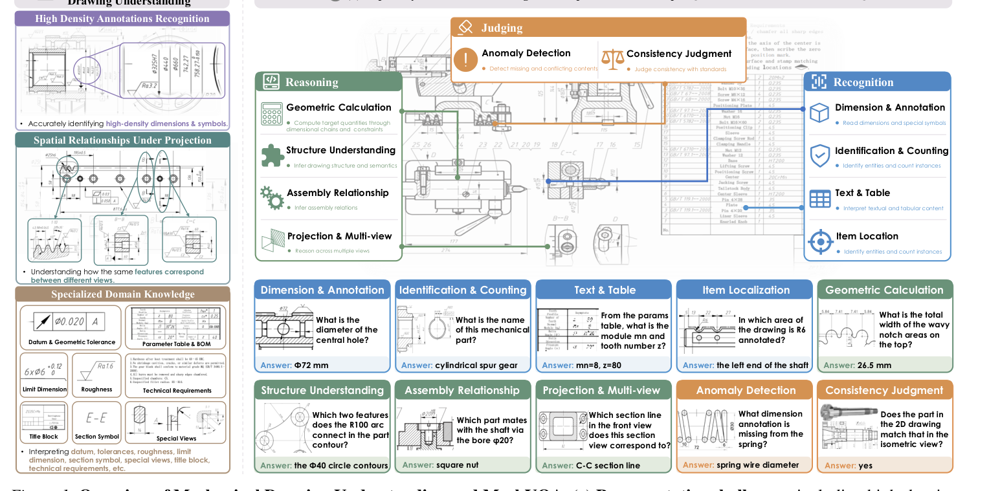
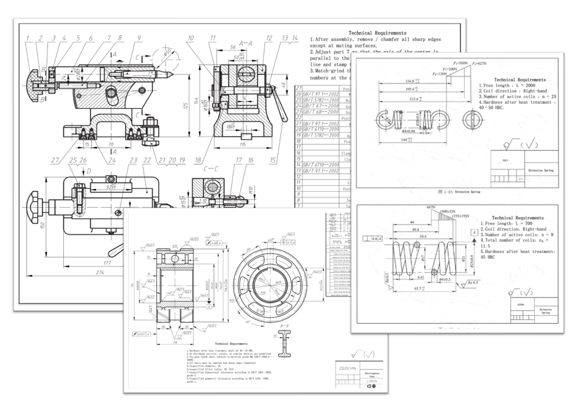
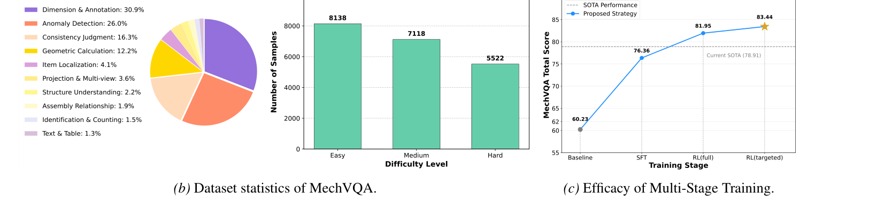
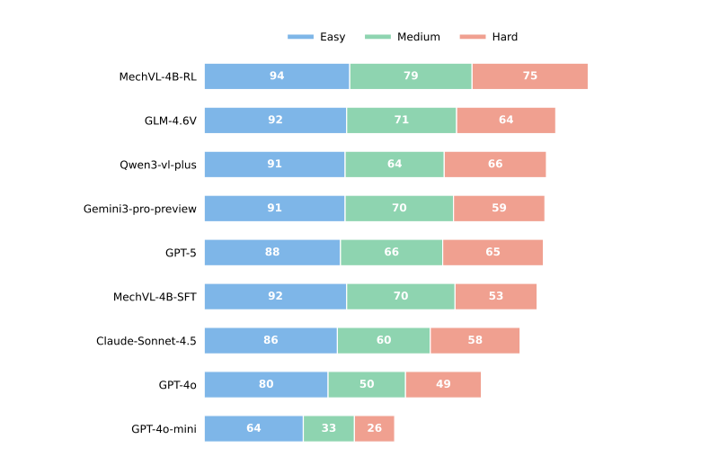
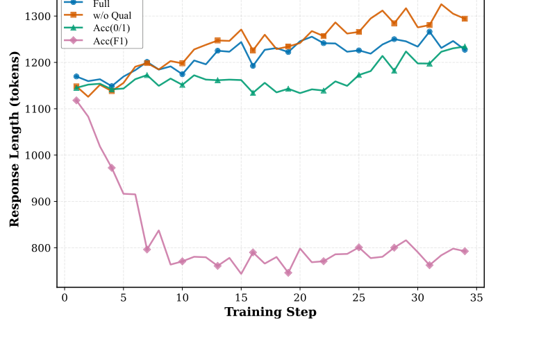

<!-- paper-reading-lang: en -->
<!-- paper-reading-theme: cobalt -->
# MechVQA: a mechanical-drawing benchmark, and the 4B model that tops it

> **Reading orientation.** General multimodal LLMs fail on mechanical engineering drawings in ways that go beyond recognition: dense annotations hide decisive cues, projection rules demand cross-view correspondence, and drafting standards require domain knowledge. This paper contributes both a yardstick and a climber: MechVQA, a 20,778-pair benchmark built under multi-stage quality gates, and MechVL, a 4B domain-specialized model whose SFT→DAPO training ladder reaches a Total score of 84.85, above every open- and closed-source baseline tested. Original paper: Qian Kou, Xiaofeng Shi (equal contribution, co-corresponding), Yulin Li, Xiaosong Qiu, Xinyang Wang, Hua Zhou, Cao Dongxing, *MechVQA: Benchmarking and Enhancing Multimodal LLMs on Comprehensive Mechanical Drawing Understanding* (ICML 2026). <span class="source-ref">This reading uses arXiv:2605.30794v2 (7 July 2026), 28 pages: main text §§1–6 plus appendices A–C; Figs. 1–18; Tables 1–7.</span>

## 01 / The whole paper at a glance

**One-sentence thread:** the authors argue that mechanical drawing understanding fails at three distinct levels — reading dense annotations, reasoning under projection rules, and judging against drafting standards — so they build a benchmark that measures all three levels separately, then show that a small model with domain-targeted post-training can beat much larger general MLLMs on it. (PDF §§1–2, 5)

The problem is not optical character recognition. A mechanical drawing encodes semantics in a compact graphical language: orthographic multi-view projections, dense dimensioning, section views, symbolic notations, and structured text. The paper's diagnosis (PDF §1) names three compounding factors: **high annotation density** (decisive cues are easy to miss), **weak domain priors** (datums, geometric tolerances, roughness conventions), and **unreliable spatial reasoning under projection rules** (the same feature must be tracked across views). Existing adjacent benchmarks cover only slices of this space — rulebook QA, blueprint symbols, AEC floor plans, or physics puzzles — leaving no unified evaluation of recognition, reasoning, and judgment on real part and assembly drawings. (PDF §1, Table 1)

```paper-map
{
  "thesis":"Mechanical drawings break general MLLMs at three levels — dense reading, projection-consistent reasoning, standards-aware judging. MechVQA measures each level separately, and MechVL shows domain post-training closes much of the gap.",
  "outcome":"A 3,281-drawing, 20,778-pair benchmark with quality-gated verifiable answers, plus a 4B baseline reaching Total 84.85 — +5.94 over the best open-source and +7.57 over the best closed-source MLLM tested.",
  "outcomeSource":"PDF §§3–5, Tables 1–2",
  "items":[
    {"number":"01","label":"Problem","signal":"3 compounding factors","text":"High annotation density hides decisive cues; weak domain priors mishandle drafting conventions; spatial reasoning fails under strict projection rules. Adjacent benchmarks cover only slices.","source":"PDF §1"},
    {"number":"02","label":"Benchmark","signal":"gates at every step","text":"Expert-filtered drawings, OCR + MLLM metadata with human verification, three QA-generation routes, cross-model question validation, majority-voted answers, and a leakage-controlled 8:1:1 split.","source":"PDF §3, Fig. 2a"},
    {"number":"03","label":"Model & evidence","signal":"SFT → DAPO ×2","text":"MechVL-4B: SFT for schema and grounding, then two-stage self-play DAPO with a format/accuracy/quality reward. Ablations isolate stages, RL algorithm, and reward design.","source":"PDF §§4–5, Tables 2–3"}
  ]
}
```

**Where the evidence enters:** Table 2 ranks 17 general MLLMs plus MechVL on the test split; Figure 3 breaks scores down by difficulty; Table 3 runs three controlled ablations (training stages, RL algorithm, reward design); Table 5 quantifies how much expert verification changes the metadata the whole pipeline depends on. (PDF §5, App. B.2)

**Original Figure 1 answers two orientation questions at once.** Panel (a), left column: what makes mechanical drawings hard — high-density annotations, cross-view spatial correspondence, and a specialized symbol vocabulary (datum and geometric tolerance, parameter tables, limit dimensions, roughness, technical requirements, title blocks, section symbols). Panel (b), right and bottom: how MechVQA's ten subtasks map onto the three capability axes, each card showing one real example question and its answer — read one card per subtask to calibrate what the benchmark actually asks. (PDF p. 2, Fig. 1)



*Original paper Fig. 1.<span class="source-ref"> PDF p. 2.</span> The example cards are real benchmark items, e.g. Dimension & Annotation asks “What is the diameter of the central hole?” (answer Φ72 mm); Projection & Multi-view asks which section line a section view corresponds to (answer C-C).*

## 02 / Building MechVQA: from drawings to verifiable QA pairs

A benchmark's claims are only as strong as its construction. MechVQA's pipeline is built around a deliberate trade: **answerability and verifiability over brute-force scale**. Every stage has a quality gate with a discard path, and anything that cannot be verified is revised or removed rather than kept for volume. (PDF §3.3)

```paper-path
{
  "title":"From source drawings to the 20,778-pair dataset",
  "intro":"Pre-processing secures trustworthy drawings and metadata; three generation routes produce candidate questions; two voting/validation gates keep only uniquely answerable pairs.",
  "stages":[
    {"title":"Curate and filter drawings","role":"secure source quality","action":"Collect part and assembly drawings from public textbooks, professional handbooks, and design platforms; domain experts remove low-quality, incomplete, or poorly scanned sheets.","why":"The benchmark targets standards-oriented public drawings; broken scans would poison every downstream step.","output":"3,281 high-quality drawing images.","source":"PDF §3.1"},
    {"title":"Extract and verify metadata","role":"build a reliable structured basis","action":"An OCR model (MinerU2.5) extracts textual content; strong closed-source MLLMs infer other metadata fields; mechanically trained graduate students then verify every field under an internal annotation handbook.","why":"Template questions and ground-truth answers are built from this metadata — errors here become wrong labels. Correction-rate analysis (Table 5) shows this gate is not cosmetic.","output":"Expert-verified metadata per drawing.","source":"PDF §3.1, App. B.1–B.2"},
    {"title":"Generate candidate questions","role":"cover the taxonomy","action":"Three sources: (I) free generation — a closed-source MLLM assesses drawing complexity and drafts subtask-labeled questions; (II) template-based without ground truth — subtask-specific templates bind symbols to features; (III) template-based with ground truth — metadata-grounded deterministic templates, expert-built 2D/3D view matching, and CAD-edited anomaly questions.","why":"Free generation gives open coverage; templates give controllable subtask balance; metadata- and expert-grounded items give known answers, including deliberately injected inconsistencies for judging tasks.","output":"Candidate questions with subtask and difficulty labels.","source":"PDF §3.3"},
    {"title":"Cross-model question validation","role":"keep only answerable questions","action":"In iterative rounds, a different model acts as validator: each question is accepted, rewritten to fix violations, or rejected as unanswerable, checking grounding, unique answerability, and subtask consistency.","why":"A question that refers to a nonexistent symbol or admits multiple readings cannot yield a verifiable label.","output":"Validated question set.","source":"PDF §3.3, App. B.5"},
    {"title":"Multi-model answering and majority vote","role":"assign trusted answers","action":"Multiple strong models answer each question; a strong LLM judge compares core semantics and keeps only pairs with a clear majority. All answers carry a detailed explanation plus a short final answer.","why":"No single model is trusted as oracle; agreement is the proxy for correctness, and the explanation scaffold later feeds RL training.","output":"20,778 QA pairs with explanation + final answer.","source":"PDF §3.3–3.4, App. B.4"},
    {"title":"Leakage-controlled split","role":"protect the evaluation","action":"Split 8:1:1 at drawing-group level — all QAs from one drawing stay in one split. Fused CLIP representations (mean text + image embeddings) are clustered so near-duplicate drawing variants land in the same split, stratified over source, subtask, and difficulty; t-SNE visually confirms matched coverage.","why":"Near-duplicate drawings across train and test would inflate scores; the authors still caution that public-source contamination cannot be fully ruled out.","output":"Train/validation/test splits for evaluation and post-training.","source":"PDF §3.4, App. B.6"}
  ]
}
```

**Original Fig. 2a draws this pipeline as three gated zones.** Read left to right: the purple pre-processing zone contains Quality Gate 1 (image filtering, with a discard bin) and Quality Gate 2 (experts check and refine OCR + model-extracted metadata); the green zone is iterative question generation with the Fail/Refine loop feeding back into question generation and Quality Gate 3 discarding failed questions; the orange zone is answer-side validation, where multi-model generation goes through response validation and voting before anything enters the high-quality dataset that feeds SFT and RL training. Note that both the question side and the answer side have their own discard paths — nothing passes on a single model's say-so. (PDF p. 5, Fig. 2a)


*Original paper Fig. 2a.<span class="source-ref"> PDF p. 5.</span> Red “Discard” bins are the important arrows: quality control is implemented as deletion, not as a score.*

**Is the expert-verification gate doing real work? Table 5 says yes, with numbers.** Comparing model-extracted metadata against expert-corrected metadata on the audited groups: view counts are corrected in 41.6% of cases (models usually undercount), section views in 37.8% (confused with section-like or directional views), side/top views in 33.0%/31.8% (systematically over-labeled), technical requirements in 43.7% (surface treatments, heat-treatment parameters, chamfer notation), while coarse part-category labels change in under 1% of cases. The error patterns are systematic, not random — exactly the kind a handbook-guided human pass can fix. (PDF App. B.2, Table 5)

**What do the source drawings actually look like? Original Fig. 5 shows typical examples** — assembly sheets with numbered part callouts and BOM tables, spring drawings with technical-requirement blocks, and multi-view part drawings dense with dimensional chains. This is the visual regime the benchmark stresses: decisive information is present, but spread across views, tables, and symbols at high density. (PDF p. 13, Fig. 5)



*Original paper Fig. 5.<span class="source-ref"> PDF p. 13.</span>*

## 03 / The measurement design: what is being counted

**Ten subtasks, three axes, three difficulties.** Recognition covers explicit information: Identification & Counting (IC), Dimension & Annotation (DA), Text & Table (TT), Item Localization (IL). Reasoning covers inference beyond direct reading: Structure Understanding (SU), Geometric Calculation (GC), Assembly Relationship (AR), Projection & Multi-view (PM). Judging covers decisions under engineering rules: Anomaly Detection (AD) and Consistency Judgment (CJ). Each question carries exactly one subtask label and one difficulty label (easy/medium/hard, defined in App. B.3). (PDF §3.2, App. B.3)

**Original Fig. 2b exposes the dataset's shape — and it is intentionally uneven.** The pie chart shows subtask shares: Dimension & Annotation 30.9%, Anomaly Detection 26.0%, Consistency Judgment 16.3%, Geometric Calculation 12.2%, then a long tail (IL 4.1%, PM 3.6%, SU 2.2%, AR 1.9%, IC 1.5%, TT 1.3%). The bars show difficulty counts: 8,138 easy, 7,118 medium, 5,522 hard (summing to 20,778). The right panel (c) previews the training ladder discussed in §§04–05. Keep the skew in mind when reading headline scores: the two judging subtasks plus DA account for nearly three quarters of all questions. (PDF p. 5, Fig. 2b; §3.4)



*Original paper Figs. 2b–2c.<span class="source-ref"> PDF p. 5.</span> The line panel's last point is discussed in §05 — its printed value (83.44) differs from the 84.85 reported in Tables 2–3, a discrepancy flagged there.*

**Total and Avg are two different readings of the same table.** The paper defines Avg. explicitly as the mean over all ten subtask scores (a macro average); Total is reported as the headline number and reads as question-level accuracy over the whole test set, which weights the frequent subtasks (DA, AD, CJ) much more heavily (reader inference — the text does not define Total's aggregation explicitly; a weighted estimate from the subtask distribution lands near, though not exactly on, the reported value, since the test split's composition differs slightly from the full dataset). The two can move differently: in Table 3(A), targeted RL lifts Total by +2.90 over full-data RL but Avg. by +4.14, because it improves the rare reasoning subtasks that Avg. counts equally. (PDF §5.3, Table 3)

**How answers are scored (App. C.4).** The evaluator extracts the content of the model's `<answer>` tag when present (else text after `</think>`, else the full response). Three LLM judges — GPT-OSS-120B, DeepSeek-V3.2, and Kimi-k2, temperature 0.1 — independently score semantic consistency with the ground-truth answer as binary 0/1; the final score is the most frequent vote among valid judges. Crucially, judges see only the question, the ground truth, and the model answer — **not the drawing** — so judging is post-hoc answer verification, not a second attempt at the visual problem. Unparseable or failed judge calls fall back conservatively to 0. (PDF App. C.4, Fig. 18)

```paper-contrast
{
  "title":"How MechVQA differs from adjacent engineering-VQA data",
  "intro":"Adjacent benchmarks are complementary but scoped to slices; MechVQA's claim is unified coverage of recognition, reasoning, and judging on real part and assembly drawings.",
  "branches":[
    {"name":"Adjacent slices","lead":"Each existing set stresses one facet of engineering-document understanding.","scope":"Rulebook-grounded requirements QA (DesignQA), blueprint symbol recognition (BlueprintSymVL), AEC floor-plan literacy (AECV-Bench), physics-puzzle mechanics (MechBench), tri-view projection reasoning (CReFT-CAD), parametric primitives (PHT-CAD).","judge":"Engineering-drawing analysis is often a small, non-open component within broader suites.","signal":"No single set jointly stresses structured perception, multi-view consistency, and engineering-grade judgment on real mechanical drawings.","why":"Paper's stated gap motivating a dedicated benchmark (Table 1 compares sizes and task focus).","source":"PDF §1, Table 1"},
    {"name":"MechVQA","lead":"One benchmark, three capability axes, ten subtasks, three difficulty levels.","scope":"3,281 real part and assembly drawings with 20,778 QA pairs; includes 2D–3D view matching and expert-edited anomaly items.","judge":"Every QA pair passes cross-model question validation and majority-voted answers; metadata is expert-verified.","signal":"A testbed that can localize failure at reading, reasoning, or judging — not just report one aggregate number.","why":"This is the paper's central benchmark claim (stated as 'the first comprehensive mechanical drawing understanding dataset').","source":"PDF §§1, 3"}
  ]
}
```

## 04 / MechVL: the training ladder behind 84.85

MechVL is deliberately simple in architecture — Qwen3-VL-Instruct-4B with the vision side frozen — and puts all the leverage in post-training. The ladder has three rungs: SFT for grounding and schema, full-data DAPO for reliability, then targeted DAPO that resamples weak subtasks. (PDF §4)

```paper-path
{
  "title":"From Qwen3-VL-4B to MechVL-4B-RL",
  "intro":"SFT creates the reference policy; both RL stages use the same DAPO objective and composite reward — only the sampling distribution changes.",
  "stages":[
    {"title":"Supervised fine-tuning","role":"ground drafting cues and enforce schema","action":"Full-parameter SFT on the LLM module only — vision encoder and projection layers stay frozen — on the MechVQA train split; each instance is (optional drawing, question, target response with rationale + concise final answer), trained with standard causal LM loss (Eq. 1).","why":"The model must first learn the <think>/<answer> schema and convention-consistent mechanical phrasing before RL can score it meaningfully.","output":"Reference policy πref (MechVL-4B-SFT, Total 76.36).","source":"PDF §4.1, Eq. 1"},
    {"title":"Sample a response group","role":"explore per prompt","action":"For each prompt (drawing + question with a verifiable answer), sample G = 10 candidate responses from the old policy.","why":"Group-relative scoring turns each prompt into its own baseline — no separate value critic is needed.","output":"A group of 10 scored responses per prompt.","source":"PDF §4.2, App. C.2"},
    {"title":"Score with the composite reward","role":"define what 'better' means","action":"Each response gets R = λacc·racc + λfmt·rfmt + λqual·rqual (Eq. 6): semantic accuracy against ground truth via LLM judge [0,1], binary format compliance {0,1}, and LLM-judged quality over Logic/Professionalism/Conciseness [0,1] (Eq. 7); weights 0.60/0.10/0.30 by ablation (Table 7).","why":"Strict string matching would give zero reward to correct answers phrased differently; pure accuracy rewards invite degenerate or verbose outputs — format and quality terms counter both.","output":"Scalar reward per response.","source":"PDF §4.2, Eqs. 6–7; App. C.3"},
    {"title":"DAPO update (stage 1, full data)","role":"optimize with stabilized policy gradient","action":"Compute group-relative advantage (Eq. 2), token-level importance ratios (Eq. 3), and a PPO-style surrogate with decoupled clipping [0.20, 0.28] (Eq. 4); Dynamic Sampling discards all-correct or all-wrong groups (Eq. 5); overlong reward shaping handles truncation; no KL penalty to the SFT reference.","why":"Long-form drawing analysis needs stable advantage estimates and informative groups — degenerate groups carry no signal.","output":"MechVL after full-data RL (Total 81.95).","source":"PDF §4.2, Eqs. 2–5; App. C.2"},
    {"title":"Targeted self-play RL (stage 2)","role":"rebalance toward weak subtasks","action":"Run the same objective and reward on a resampled subset with a higher share of underperforming subtasks.","why":"After stage 1, errors concentrate in reasoning-heavy subtasks; focusing updates there reduces capability imbalance rather than chasing the already-strong reading subtasks.","output":"MechVL-4B-RL (Total 84.85).","source":"PDF §4.2, §5.3"}
  ]
}
```

### The DAPO mechanics, precisely

For a prompt $u=(x,q)$ with verifiable answer $a$, sample a group $\{y_i\}_{i=1}^{G}$ from the old policy; each response gets scalar reward $R_i$. The group-relative advantage, shared by every token of $y_i$, is: (PDF §4.2, Eq. 2)

$$
\hat{A}_{i,t}=\frac{R_i-\operatorname{mean}\!\left(\{R_j\}_{j=1}^{G}\right)}{\operatorname{std}\!\left(\{R_j\}_{j=1}^{G}\right)}+\epsilon_A
$$

With token-level importance ratios $r_{i,t}(\theta)=\pi_\theta(y_{i,t}\mid u,y_{i,<t})\,/\,\pi_{\theta_{\mathrm{old}}}(y_{i,t}\mid u,y_{i,<t})$ (Eq. 3), DAPO optimizes a clipped surrogate with **decoupled** lower/upper clip ranges — the “Clip Higher” trick that keeps exploration alive by allowing larger upward moves: (PDF §4.2, Eq. 4)

$$
\mathcal{L}_{\mathrm{DAPO}}=-\,\mathbb{E}_{u,\{y_i\}}\!\left[\frac{1}{\sum_{i=1}^{G}|y_i|}\sum_{i=1}^{G}\sum_{t=1}^{|y_i|}\min\Big(r_{i,t}(\theta)\hat{A}_{i,t},\ \mathrm{clip}\big(r_{i,t}(\theta),\,1-\epsilon_{\mathrm{low}},\,1+\epsilon_{\mathrm{high}}\big)\hat{A}_{i,t}\Big)\right]
$$

and Dynamic Sampling keeps only groups that contain both correct and incorrect responses, $0<\big|\{y_i \mid \mathrm{is\_equivalent}(a, y_i)\}\big|<G$ (Eq. 5), resampling otherwise. The rationale (paper statement): an all-correct or all-wrong group has zero advantage variance and thus carries no learning signal; on long-form multimodal reasoning this filtering, plus overlong reward shaping, replaces the usual KL regularizer, which is omitted. (PDF §4.2)

**Teaching calculation (this atlas's example, not a paper experiment):** suppose $G{=}4$ responses earn rewards $[1.0,\,0.6,\,0.0,\,1.0]$ — mean $0.65$, std $\approx0.44$. The advantages are roughly $[+0.80,\,-0.11,\,-1.48,\,+0.80]$: the two correct answers push the policy up, the wrong one pushes down twice as hard, and the middling one barely matters. The group survives Dynamic Sampling because it mixes correct and incorrect; had all four been correct (an already-solved prompt), the whole group would be discarded as signal-free.

### The composite reward, precisely

$$
R(x,q,y)=\lambda_{\mathrm{acc}}\,r_{\mathrm{acc}}(x,q,y)+\lambda_{\mathrm{fmt}}\,r_{\mathrm{fmt}}(y)+\lambda_{\mathrm{qual}}\,r_{\mathrm{qual}}(x,q,y)
$$

with $r_{\mathrm{acc}}\in[0,1]$ from an LLM judge assessing **semantic equivalence** to the ground truth (deliberately not strict string matching — differently phrased correct answers still earn reward), $r_{\mathrm{fmt}}\in\{0,1\}$ requiring exactly one `<think>…</think>` span and one `<answer>…</answer>` span, and (PDF §4.2, Eqs. 6–7)

$$
r_{\mathrm{qual}}=\frac{s_{\mathrm{logic}}+s_{\mathrm{prof}}+s_{\mathrm{conc}}}{3},\qquad s_{\cdot}\in[0,1]
$$

scoring Logic (coherence), Professionalism (drafting terminology), and Conciseness. The reward-weight ablation (App. C.3, Table 7) fixes $\lambda_{\mathrm{fmt}}=0.10$ and finds the best mix at $\lambda_{\mathrm{acc}}/\lambda_{\mathrm{qual}} = 0.60/0.30$ (Total 84.85), ahead of 0.75/0.15 (83.23) and 0.45/0.45 (83.58) — accuracy dominates, but a substantial quality share is still better than none. **Teaching calculation:** a response with $r_{\mathrm{acc}}=0.8$, $r_{\mathrm{fmt}}=1$, $r_{\mathrm{qual}}=0.7$ earns $R = 0.60(0.8)+0.10(1)+0.30(0.7) = 0.79$.

**Training configuration (App. C, Table 6).** SFT: 3 epochs, AdamW lr $1{\times}10^{-5}$, weight decay 0.01, global batch 64, cosine schedule with 0.1 warmup, DeepSpeed ZeRO-3, images capped at 262,144 pixels, max sequence 4,096. RL (all three algorithms): AdamW lr $1{\times}10^{-6}$, global batch 128, linear schedule, group size 10, FSDP with CPU offload; GRPO adds a low-variance KL penalty ($\beta=0.01$, clip 0.20/0.30); GSPO uses sequence-level averaging with a very narrow clip ($3{\times}10^{-4}$–$4{\times}10^{-4}$); DAPO disables KL, clips at [0.20, 0.28], and enables online filtering. Hardware: 8× NVIDIA H800 (80GB). (PDF App. C.1–C.2, Table 6)

## 05 / Experiment atlas: which result answers which question

**Read everything under this protocol:** all models are evaluated on the MechVQA test split with the same three-judge binary protocol of §03, no external tools or retrieval. General-purpose baselines are measured as out-of-domain transfer; MechVL is the in-domain baseline quantifying targeted post-training. Table 2's full matrix has 17 general MLLMs; the table below keeps the strongest and most comparable rows. (PDF §5.1, Table 2)

| Model | DA | IL | SU | GC | AR | PM | AD | CJ | Total |
|---|---:|---:|---:|---:|---:|---:|---:|---:|---:|
| Qwen3-VL-4B-Instruct (MechVL's base) | 76.96 | 33.09 | 39.58 | 58.54 | 22.00 | 20.00 | 62.86 | 49.33 | 60.23 |
| Qwen3-VL-32B-Instruct | 86.68 | 56.83 | 62.50 | 76.83 | 62.00 | 48.00 | 75.92 | 69.33 | 76.50 |
| GLM-4.6V (best open-source) | 86.68 | 63.31 | 77.08 | 82.93 | 60.00 | 62.00 | 74.29 | 69.33 | 78.91 |
| GPT-5 | 84.99 | 62.59 | 79.17 | 73.58 | 60.00 | 60.00 | 71.02 | 70.67 | 75.44 |
| Gemini-3-Pro-Preview (best closed-source) | 87.74 | 64.03 | 52.08 | 73.58 | 46.00 | 58.00 | 78.37 | **82.67** | 77.28 |
| Qwen3-VL-Plus | 86.68 | 52.88 | 81.25 | 79.67 | 74.00 | 58.00 | 67.76 | 68.00 | 76.33 |
| Claude-Sonnet-4.5 | 78.65 | 56.12 | 70.83 | 75.20 | 62.00 | 54.00 | 64.90 | 64.00 | 71.20 |
| MechVL-4B-SFT (Ours) | 85.20 | 61.15 | 60.42 | 73.17 | 40.00 | 44.00 | 84.49 | 69.33 | 76.36 |
| **MechVL-4B-RL (Ours)** | **90.70** | **82.01** | **83.33** | 76.83 | **84.00** | **64.00** | **86.94** | 78.67 | **84.85** |

*Selected rows from original Table 2<span class="source-ref">, PDF p. 8</span> (columns IC and TT omitted — MechVL-RL ties with several models there at 88.37 / 97.73; bold marks unique best in the table). Note where RL does **not** win: GC ties Qwen3-VL-32B, and CJ stays below Gemini-3-Pro-Preview — the paper claims best only on DA, IL, SU, AR, PM, AD, plus Total.*

```paper-experiments
{
  "title":"What each reported result can answer",
  "rows":[
    {"question":"Does MechVL beat general MLLMs on this benchmark?","setup":"Table 2: 17 open- and closed-source MLLMs plus MechVL, same test split and three-judge protocol.","observation":"MechVL-4B-RL Total 84.85: +5.94 over GLM-4.6V (best open-source, 78.91), +7.57 over Gemini-3-Pro-Preview (best closed-source, 77.28), +8.49 over its own SFT stage (76.36). This is a whole-system comparison — it does not by itself isolate which design choice wins.","source":"PDF §5.2, Table 2"},
    {"question":"Where do the gains sit by difficulty?","setup":"Fig. 3: accuracy on easy/medium/hard subsets (subset sizes differ, so the paper cautions rankings here need not match Total).","observation":"MechVL-4B-RL: 94/79/75 (easy/medium/hard). Versus SFT, RL barely moves easy (92→94) but lifts medium 70→79 and hard 53→75; hard beats the best closed baseline on that subset (Qwen3-VL-Plus, 66) by 9 points. Gains concentrate where reasoning and consistency demands are highest.","source":"PDF §5.2, Fig. 3"},
    {"question":"How much does each training stage contribute?","setup":"Table 3(A): controlled stage ablation — SFT, then +DAPO on full data, then +DAPO targeted — same evaluation.","observation":"Total 76.36 → 81.95 → 84.85; Reasoning mean 54.40 → 70.75 → 77.04; Recognition 83.11 → 86.26 → 89.70; Judging 76.91 → 81.62 → 82.81. Stage-wise attribution is possible because only the training stage changes.","source":"PDF §5.3, Table 3(A)"},
    {"question":"Does the RL algorithm choice matter?","setup":"Table 3(B): GRPO, GSPO, DAPO under the same initialization and full-data setting.","observation":"DAPO best: Total/Avg. 81.95/79.12 vs GRPO 80.47/74.80 and GSPO 78.77/73.73; the largest margin is on Reasoning (70.75 vs 64.49 and 61.29). Within this paper's family of group-based optimizers, DAPO's dynamic sampling and decoupled clipping pay off most on reasoning-heavy subtasks.","source":"PDF §5.3, Table 3(B)"},
    {"question":"Does reward design matter, and why?","setup":"Table 3(C) ablates the accuracy term and the quality term in the targeted phase; Fig. 4 tracks response length during training.","observation":"Full reward best (84.85); removing quality drops to 83.44; binary accuracy 82.24; token-level F1 worst at 80.33. Fig. 4 explains the ordering: Acc(F1) collapses responses from ~1.1K to <0.8K tokens (terse, weakly grounded), w/o Qual drifts to ~1.3K (verbose without accuracy gains), Full holds a controlled 1.2K–1.25K band with the best final accuracy.","source":"PDF §5.3, Table 3(C), Fig. 4"},
    {"question":"Is the benchmark's expert verification load-bearing?","setup":"Table 5 (App. B.2): correction rates between model-extracted and expert-corrected metadata on audited groups.","observation":"View counts corrected 41.6%, technical requirements 43.7%, section views 37.8%, side/top views 33.0%/31.8% — all systematic patterns; part category changes <1%. The structured metadata feeding template questions and ground-truth answers is materially changed by the human pass.","source":"PDF App. B.2, Table 5"}
  ]
}
```

```paper-chart
{"type":"paired","title":"The training ladder on Total score","subtitle":"Each row is one stage transition; unit: points","origin":"Atlas redraw · original Table 3(A) and Fig. 2c","note":"Stage transitions from controlled ablations; Baseline is Qwen3-VL-4B-Instruct from Table 2.","source":"PDF pp. 8–9, Tables 2–3","rows":[{"label":"Baseline → SFT","before":60.23,"after":76.36},{"label":"SFT → + DAPO (full)","before":76.36,"after":81.95},{"label":"full RL → + DAPO (targeted)","before":81.95,"after":84.85}]}
```

```paper-chart
{"type":"paired","title":"MechVL-4B-RL against the strongest baselines","subtitle":"Total score; unit: points","origin":"Atlas redraw · original Table 2","note":"Whole-system comparison at fixed evaluation protocol.","source":"PDF p. 8, Table 2","rows":[{"label":"vs GLM-4.6V (open-source best)","before":78.91,"after":84.85},{"label":"vs Gemini-3-Pro-Preview (closed-source best)","before":77.28,"after":84.85},{"label":"vs GPT-5","before":75.44,"after":84.85}]}
```

**Original Fig. 3 shows why the difficulty axis matters.** Each bar is one model's easy/medium/hard accuracy. All models drop from easy to hard — harder questions demand cross-view correspondence, stricter constraint satisfaction, and multi-step reasoning — but the spread widens sharply: MechVL-4B-RL (94/79/75) keeps the flattest profile, while the same-size GPT-4o-mini collapses (64/33/26). Reading tip: compare MechVL-4B-SFT (92/70/53) with MechVL-4B-RL next to it — the RL stage's entire effect is visible as the medium and hard segments, exactly where dense-drawing reliability was the bottleneck. (PDF p. 8, Fig. 3)



*Original paper Fig. 3.<span class="source-ref"> PDF p. 8.</span> The paper itself cautions that subset sizes differ, so this ranking need not match Table 2's Total.*

**Original Fig. 4 is the mechanistic explanation for the reward ablation.** It plots response length over RL training steps for four reward designs. Acc(F1) — token-overlap accuracy — collapses from ~1.1K to below 0.8K tokens: overlap feedback rewards terseness over grounding, and it is also the worst final scorer in Table 3(C). w/o Qual climbs to ~1.3K, verbosity without matching accuracy. Full holds a controlled band around 1.2K–1.25K with the best final score — the authors read this as better-calibrated reasoning traces rather than merely longer ones. (PDF p. 9, Fig. 4)



*Original paper Fig. 4.<span class="source-ref"> PDF p. 9.</span>*

**Two source discrepancies to carry while reading the numbers.** ① The abstract and §5.2 report MechVL outperforms the strongest closed-source baseline by **7.57** points, but the introduction says it surpasses closed-source baselines “by 6%” — no reported number matches 6%; the 7.57-point gap to Gemini-3-Pro-Preview (77.28) is the one grounded in Table 2. ② Fig. 2c's training curve prints RL(targeted) at **83.44**, while Tables 2 and 3(A) report the targeted-RL model at **84.85** (83.44 coincidentally equals Table 3(C)'s w/o-Qual row). This atlas uses the table values and flags both mismatches rather than silently resolving them. (PDF pp. 2, 5, 8–9)

## 06 / Synthesis: what the evidence supports, and its boundaries

The mechanism and the measurement reinforce each other in a specific way: **the benchmark's own failure diagnosis predicts where training should help, and the ablations confirm it there.** The paper's diagnosis named dense reading, projection reasoning, and standards judging; the training ladder's controlled ablation (Table 3A) shows SFT alone lifts the base model mostly on reading, while RL — with its semantic-accuracy-plus-quality reward — delivers its largest capability gain on Reasoning (54.40 → 77.04 across both stages) and its largest difficulty gain on the hard subset (53 → 75). The reward-dynamics figure then ties the reward design to the shape of the reasoning traces themselves. Each link is supported by a controlled comparison, not just by the headline ranking. (PDF §§5.2–5.3, Figs. 3–4)

**The evaluation chain deserves a sober read (reader inference, not a paper claim).** Both ends of this work are LLM-mediated: questions and answers are generated and voted on by strong closed-source models (with expert gates), and final scoring uses three LLM judges that never see the drawing. These are different model sets at each end, and the judges do post-hoc answer verification rather than visual re-solving — a reasonable, scalable protocol — but absolute scores still inherit judge behavior, and the conservative fallback (failed judging scores 0) can punish unusual answer formats. The authors also acknowledge the related contamination caveat: public-source drawings plus web-scale pretraining means absolute leakage control is impossible; their mitigation is drawing-level and cluster-level separation. (PDF §§3.4, 5.1, Apps. A, C.4)

**Boundaries the paper states itself (App. A):** drawings come from educational/professional public sources, not proprietary industrial archives — legacy blueprints and company-specific drafting practices are out of scope; the benchmark is 2D-drawing understanding, not 3D CAD reconstruction or STEP/IGES generation; construction still depends on OCR and visual clarity; and **benchmark validation is explicitly incomplete** — no human-expert upper bound or inter-annotator agreement statistics are reported yet, so the remaining gap between MechVL and domain experts is unquantified. Release of original drawings follows the underlying materials' redistribution permissions. (PDF App. A)

**If you reproduce or build on this work:** dataset — 3,281 drawings, 20,778 pairs, 8:1:1 drawing-group split with CLIP-cluster dedup; model — Qwen3-VL-Instruct-4B, vision frozen, LLM-only full-parameter SFT (3 epochs, lr 1e-5, batch 64) then DAPO (group 10, clip [0.20, 0.28], no KL, dynamic sampling, reward 0.60 acc / 0.10 fmt / 0.30 qual), stage 2 upsamples weak subtasks; evaluation — three LLM judges (GPT-OSS-120B, DeepSeek-V3.2, Kimi-k2, temp 0.1) with binary semantic scoring and majority vote; training framework — LLaMA-Factory (SFT) and EasyR1 (RL) on 8× H800. Code: github.com/xiaofengShi/MechVQA. (PDF §§3–5, Apps. B–C)
