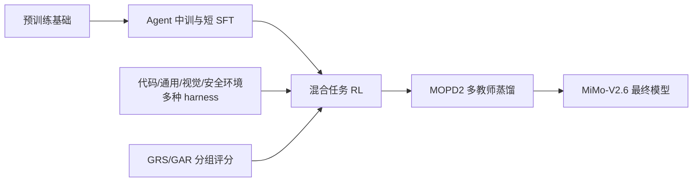

# MiMo-V2.6：从全局图读到训练机制与实验

> 阅读对象：[MiMo-V2.6: Scaling Reinforcement Learning Towards Self-Improvement](/Users/baai/Downloads/MiMo_V2_6_technical_report.pdf)，LLM-Core Xiaomi，44 页本地 PDF（SHA-256: `7fe42601dc952cd2b74996e5a24f8e85eab6fcbf471f73ba95aafd559d4ef39b`；PDF 未随仓库分发）。本文是**理解优先**的深读样例：先重建系统和论文叙事，再追到机制与实验。页码均指 PDF 页码；这份样例未对外部代码或更新版本做交叉核验。
>
> [打开可探索的全局训练图](mimo-v2.6.workflow.html) · [图的可编辑 JSON](mimo-v2.6.workflow.json) · [打开评分机制图](mimo-v2.6-grading.workflow.html)

## 1. 三分钟建立全局认知

**问题。** 报告关注长时程 agent 的强化学习：模型需要在复杂环境中产生大量轨迹，环境要覆盖不同任务和工具接口，而二值测试奖励不能区分“都通过了测试但质量不同”的解法。作者把这三个瓶颈分别对应到训练计算、环境与 harness 多样性、grader 计算。这个概括来自论文引言与 §4，而不是对某一个模块的独立因果证明。（PDF pp. 3, 8–9, 16）

**主张的系统路径。** 预训练基础模型 → agent 中期训练扩展长上下文与探索空间 → 短 SFT → 混合任务 RL → MOPD2 蒸馏形成最终系列模型。RL 阶段的三条放大轴是批量/吞吐、任务与 harness、以及更细的评分信号。最终模型评测见 Table 3；训练过程与组件实验分布在 Fig. 3、7–11 和 Table 6–7。不要把最终模型 Table 3 的分数当作单独 RL 或 GAR 的增益。（PDF pp. 3, 7–9, 16–26, 34–36）

**如何读图。** 横向是训练阶段；两个侧输入说明 RL 为什么能“扩规模”：更多真实交互轨迹与更细的学习信号。MOPD2 是 RL 之后的能力整合阶段，不应从图中误读为每步 RL 都会蒸馏。来源：PDF pp. 3, 7–9, 16–18, 24–26。

## 2. 方法主线：一轮 RL 如何运转

报告使用大批量混合任务 RL。每步抽取 1,568 个 prompts，每个 prompt 生成 16 条 rollout，约 25,000 条序列、合计 2.7–3.7B 训练 token。训练式（1）的要素是采样策略产生轨迹、grader/环境反馈形成序列级 advantage，再把该信号广播到 token 级更新；还包含重要性比率与 token mask。基础流程并不要求读者先理解所有分布式系统细节。（PDF p. 8, Eq. 1；p. 9）

**三个计算预算分别花在哪里。** Rollout 负责探索，grader 负责区分解法，training 用学习信号更新参数。Fig. 3 右图中 Pro 报告的成本占比分别为 rollout 43.8%、grader 12.7%、training 43.5%；这是该报告所列成本分解，不是所有模型或所有训练阶段的通用比例。（PDF pp. 8–9, Fig. 3）

**环境为什么要多样。** 任务覆盖代码、通用、视觉和安全；同一类代码任务又可以用多个 mini-harness 执行。Harness 的变化改变工具接口与交互路径，训练若只适应一个外壳，就可能学到外壳特定策略。作者在 Fig. 10 用训练 harness 和未见过的 harness 分开画曲线，专门观察迁移。（PDF pp. 9–16, 22–23）

## 3. 机制放大：二值奖励如何变成质量信号

这里的关键是分清 **GRS** 与 **GAR** 的适用任务和时间位置。它们不是同一条轨迹连续经过的两个评分器，而是用于不同代码任务子集的互补方法。（PDF p. 16, Fig. 7）

| 机制 | 何时建立标准 | 哪些任务 | 实际改变什么 | 原文位置 |
|---|---|---|---|---|
| GRS，Groupwise Reward Synthesis | 训练前看多条离线 rollout，生成任务专属 rubric；训练时复用 | 一部分高通过率代码任务 | 用实现质量与行为质量分数细化通过测试的奖励 | PDF pp. 16–18, Fig. 7a, Eq. 2 |
| GAR，Groupwise Advantage Redistribution | 训练中在线对同组轨迹比较 | 其余代码任务为主，且可比较的 mixed-outcome group | 在通过的轨迹之间重新分配正 advantage；确认的 hack 归零 | PDF pp. 16–19, Fig. 7b, Eq. 3 |

### GRS：先写评分尺，再逐条打分

离线阶段，grader 同时看任务说明、仓库和多个解法，把“好实现”与“好解题行为”分成两套 rubric。训练阶段，新 rollout 分别得到解决方案分数 $S_i^{\mathrm{sol}}$ 与行为分数 $S_i^{\mathrm{beh}}$，最终奖励为：

$$R_i = R_i^{\mathrm{test}}\,S_i^{\mathrm{sol}}\,S_i^{\mathrm{beh}}.$$

这意味着未通过测试的轨迹继续得零；通过测试的轨迹仍会因补丁质量或验证行为而区分。即便一组轨迹全通过，仍可能有非零差异信号。论文特别说明 rubric 以任务要求为依据，不把某个成功解法的偶然选择硬变成所有解法的要求。（PDF pp. 17–18, Eq. 2）

### GAR：保留组内正优势总量，重新分配给更好的通过解

在线阶段，grader 把同一任务的一组成功和失败轨迹放进共享工作区，比较通过的补丁；维度包括方案适合度、实现准确性、最小改动、外部副作用与代码工艺。对确认依赖外部泄露答案的轨迹，先把有效奖励归零并重算组统计。然后用质量因子压低低质量通过解的正 advantage，再重标定，使通过解的正 advantage 总量在未截断式中保持不变。实际实现还对重标定因子设上限，并使最终组均值为零。（PDF p. 18, Eq. 3）

**一个直观例子。** 若两个补丁都通过测试，但 A 是局部、可验证的改动，B 加了宽泛兼容分支，二值测试给出的信号相同；GAR 会把更多正向学习权重分给 A。这是对机制的解释性例子，不是论文报告的具体样本。（机制来源：PDF pp. 17–19）

[交互查看：轨迹到学习信号](mimo-v2.6-grading.workflow.html) · [评分图 JSON](mimo-v2.6-grading.workflow.json)

### 长轨迹为什么需要专门的基础设施

报告 §6 把一条 agent rollout 组织成 **Sample → Sequence → Context → Segment**：一题可采样多条执行序列，一条序列可有并发对话分支，一个 Segment 是一次消息/生成/工具结果；只有模型生成的 turn 进入训练损失。Penalty Module 可按层级遮罩或调整 advantage，让环境故障和局部模型错误得到不同处理。这个结构解释了为何一条长轨迹不能简单当成一条普通文本序列。（PDF pp. 26–27）

Fig. 14 的系统图可读成两条路径：控制面用轻量 metadata 调度，数据面把 token、路由、采样和多模态 payload 放进分布式存储，到 pack 阶段才按训练 rank 取需要的片段；Harness Pool 用持久多租户 actor 承载并发 agent/harness。Sample Mixer 则在任务耗时和过滤率差异很大时，维持目标任务混合比例。报告中 25 个数据源的平均生成 token 与活动 rollout 时长分别相差约 90× 与 66×，说明调度异质性是实际问题。（PDF pp. 27–30, Fig. 14–15）

### MOPD2：RL 之后怎样合并能力

MOPD2 使用不同领域的教师：可验证任务可用 mixRL 教师，开放域任务可用高质量合成演示训练的 SFT 教师。Standard MOPD 在适合的领域让学生完整 rollout；Prefix-Conditioned OPD 从教师轨迹或 SFT 数据抽取历史前缀，由学生自己生成下一 turn，再由相应教师在同一历史与学生前文条件下给 token 级监督。因此 SFT 前缀提供**上下文**，不是固定续写目标。这个区别能帮助理解它为何被放在混合 RL 之后来覆盖难以设计可靠奖励的任务。（PDF pp. 24–25, Fig. 13）

## 4. 实验图谱：每张图回答什么

| 问题 | 设计与观察 | 应怎样读 | 来源 |
|---|---|---|---|
| 增加 RL 计算后，同一个模型的表现如何变化？ | Fig. 3：DeepSWE v1.1 average@3，Pro 从 58.4 到 72.6（+14.2 个百分点），Flash 从 48.7 到 65.7（+17.0 个百分点），横轴为累计 RL 成本。 | 这是各自训练过程的趋势，能说明报告中的两条运行轨迹随计算增加而改进；不要当成单个机制的隔离实验。 | PDF p. 8, Fig. 3 |
| 在线 GAR 对训练动态有什么影响？ | Fig. 8：Flash 的 code-only RL，在 batch 128、token-mean loss 下比较有/无 GAR；有 GAR 的 pass rate 后续仍增长，turn 数大致稳定，token 长度增长较缓。 | 更接近 GAR 的定向比较。图的曲线没有给出可直接引用的精确终点表值；因此这里报告趋势，不编造精确差值。 | PDF pp. 18–19, Fig. 8 |
| 多 harness 训练是否迁移到未见 harness？ | Fig. 10：4 个训练 mini-harness 与 3 个 held-out harness 分开评估；held-out 均值 pass@1 约 50% → 66%。 | 这是“跨 harness 迁移”的直接观察；仍限于该 DeepSWE 设置与这些 harness。 | PDF p. 23, Fig. 10 |
| 冻结 MoE router 是否改善负载稳定性？ | Fig. 11：比较仅 router 是否冻结的 Pro RL 运行。可训练 router 的 L9 负载 CV 约 0.78→2.0、峰值 6×→16×、冷专家 0.5%→22%；冻结时三项基本平稳。 | 论文还做了 step-20 router 参数恢复诊断；这比只看最终分数更有助于理解负载失衡的来源。 | PDF pp. 23–24, Fig. 11 |
| 小模型和开放环境能否复现跨域 RL 收益？ | Table 6：同一 Distill-Qwen-9B SFT 起点，按领域分别做 GRPO；表中 11 项报告指标均高于 SFT，如 SWE-bench Verified avg@3 61.1→66.2，Terminal Bench 2.1 avg@1 37.1→52.8。 | 它支持“这套公开资源可用于多域 RL”的叙述；不是 Pro/Flash 大模型混合 RL 的直接消融。不同任务的 avg@1 与 avg@3 不相互合并。 | PDF pp. 34–35, Table 5–6 |
| 开放小模型的多 harness 训练能否跨执行外壳改善？ | Table 7：从相同的 Distill-Qwen-9B SFT 起点，4 个训练 mini-harness；在 3 种代码评测 × 7 个 harness 的 21 个组合上报告多 harness RL 相比 SFT 均改善。 | 这是与 Table 6 的单 harness 领域 RL 分开的实验，不应合并成同一差值。 | PDF pp. 35–36, Table 7 |
| 最终系列达到什么水平？ | Table 3 汇总 Pro/Flash、前代模型及其他模型在多域 benchmark 的结果。 | 最终分数包含前面多个阶段的影响，阅读时逐行确认任务、协议和比较对象。 | PDF pp. 25–26, Table 3 |

**读图顺序建议。** 先 Fig. 3 看主结果随 RL 计算变化，再用 Fig. 7–8 看评分机制及其定向比较，Fig. 10 看 harness 迁移，Fig. 11 看训练稳定性；最后看 Table 3 和 Table 6 分清最终模型能力与公开小模型实验。Fig. 9 还显示多个领域的训练表现与 token 使用一起增长，提醒读者性能变化伴随推理/交互预算变化。（PDF pp. 8, 17–26, 34–35）

## 5. 回到整篇论文：哪些认识可以带走

1. **核心系统思想**：要把 agent RL 扩到长轨迹与多领域，训练吞吐、可交互环境和评分粒度需要一起设计。论文提供完整训练链条，并把最关键的瓶颈转成具体工程/算法组件。（PDF pp. 3, 8–19, 26–32）
2. **最容易记住的机制**：GRS 是离线构造可复用 rubric 后逐条细化奖励；GAR 是训练时在线比较同组轨迹、重新分配通过解的优势。两者针对不同任务子集。（PDF pp. 16–19）
3. **最有解释力的实验**：Fig. 8 观察 GAR 的训练动态；Fig. 10 观察未见 harness 的迁移；Fig. 11 对 router 冻结有更清晰的对照和参数恢复诊断。这些分别回答不同问题，不能相加成一个统一因果证明。（PDF pp. 18–24）
4. **需要保留的边界**：Fig. 3 是大规模训练曲线，不隔离三条放大轴各自的贡献。Table 3 是最终系列比较，Table 6 是 Distill-Qwen-9B 的领域单独 RL。表之间模型、阶段和协议不同。（PDF pp. 8, 26, 34–35）

**源文件内部冲突。** PDF p. 3 把 Pro 写作“1.02T 总参数、42B active parameters”，而 PDF p. 6 的 Table 1 把其 active parameters 写成“42T”。这里保留两处原文并将后者标为表内疑似笔误；本样例不把冲突数字用于进一步计算。

**继续阅读路径。** 想理解训练式，读 PDF pp. 8–9 的 Eq. 1；想理解 grader，连读 pp. 16–19 的 Fig. 7、Eq. 2–3、Fig. 8；想了解开放复现资源，读 pp. 33–36 的 Table 4–7。若目标变为复现或审稿，再扩展到附录、代码和协议核查。
