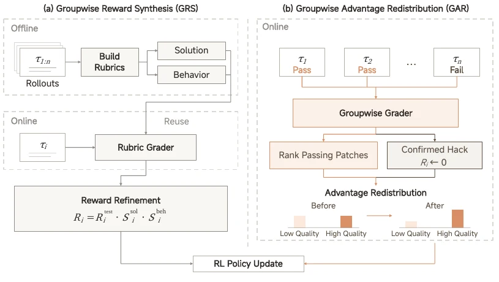
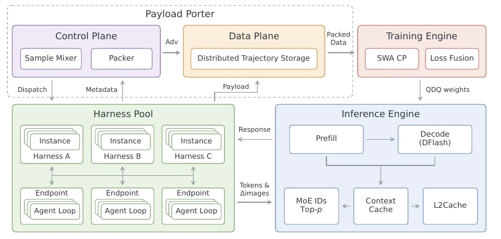
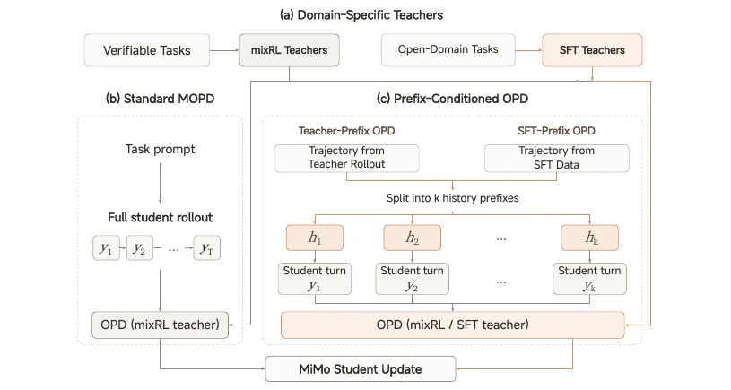
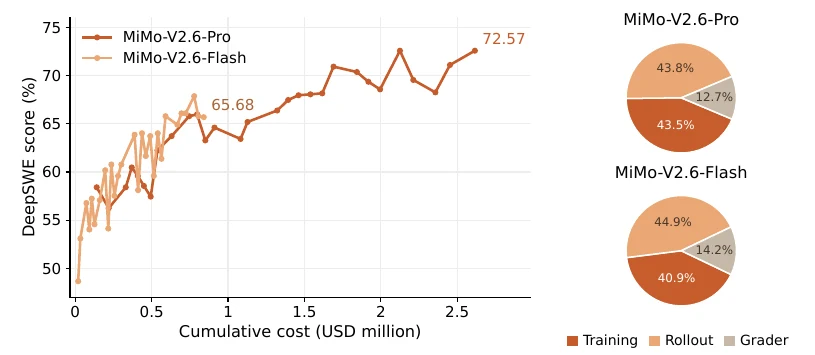
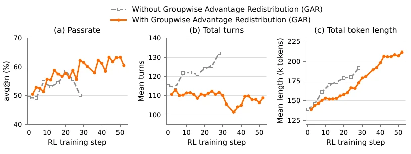
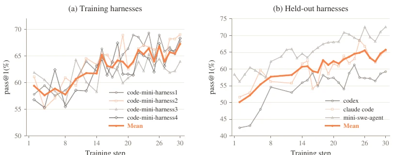
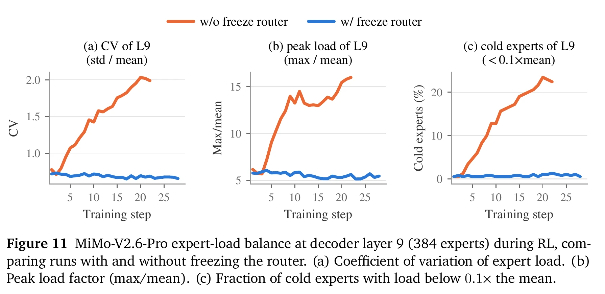

# MiMo-V2.6：Agent 强化学习的规模化路径

> **阅读定位**：从全局训练链、关键学习信号到实验与基础设施，完整理解这篇报告。原文为 LLM-Core Xiaomi 的 *MiMo-V2.6: Scaling Reinforcement Learning Towards Self-Improvement*。<span class="source-ref">本样例依据用户提供的 44 页 PDF（SHA-256：7fe42601dc952cd2b74996e5a24f8e85eab6fcbf471f73ba95aafd559d4ef39b）；页码均指该 PDF 的页码。PDF 未随仓库分发；外部代码和更新版本未核验。</span>

## 01 / 研究问题与训练链

**一句话主线：** 作者认为，长时程 Agent RL 要继续扩展，不能只加训练算力；还需要多样化的可交互任务和 harness，以及能区分“同样通过测试、但质量不同”的评分信号。报告围绕这三条轴组织系统设计与实验。（PDF pp. 3, 8–9, 16）

```paper-map
{
  "thesis": "扩大 Agent RL，需要同时扩大探索、可交互任务和质量判断。三条轴缺一条，更多轨迹也未必带来更多有效学习。",
  "outcome": "共同支撑：长时程 Agent RL 的有效扩展",
  "outcomeSource": "PDF pp. 3, 8–9, 16",
  "items": [
    {"number":"01", "label":"训练计算", "signal":"约 25K 轨迹 / 步", "text":"大批量、长轨迹、异步 rollout，让 RL 可以持续探索。", "source":"PDF pp. 8–9"},
    {"number":"02", "label":"任务与环境", "signal":"4 类任务", "text":"代码、通用、视觉和安全任务，加上多种 agent harness。", "source":"PDF pp. 9–16, 22–23"},
    {"number":"03", "label":"评分计算", "signal":"GRS + GAR", "text":"GRS/GAR 在二值测试之外区分解法质量与行为。", "source":"PDF pp. 16–19"}
  ]
}
```

上述三条轴集中作用于混合任务 RL。它位于多模态预训练及 Agent 中训/SFT 之后、MOPD2 之前；最终评测展示训练后的模型表现。（PDF pp. 3, 7–9, 24–26）

```paper-path
{
  "title":"从基础模型到最终评测",
  "stages":[
    {"title":"多模态基础模型","role":"建立可扩展的能力底座","action":"以稀疏 MoE 为骨干，交错使用局部滑窗注意力与全局注意力，并接入视觉、音频编码器；预训练提供通用知识和多模态理解。","why":"长上下文与多模态交互需要足够的基础能力，同时控制全局上下文的计算代价。","output":"能够进入 Agent 任务训练的基础模型。","source":"PDF p. 3, §1；pp. 5–7"},
    {"title":"Agent 中训与短 SFT","role":"让模型适应长时程交互","action":"Agent 中训拓展可探索任务空间；上下文长度扩到 1M，然后以较短 SFT 阶段衔接 RL。","why":"仅有预训练知识不足以支撑多步工具使用与长轨迹问题求解。","output":"供混合任务 RL 继续优化的初始化。","source":"PDF pp. 3, 7–8"},
    {"title":"混合任务 RL","role":"扩大探索、环境和评分","action":"一个典型训练步采样 1,568 道题、每题 16 条 rollout；代码、通用、视觉和安全任务共用训练流程，测试与 grader 将轨迹变成优势信号。","why":"训练算力决定探索量；环境与 harness 决定可探索问题；评分决定哪些轨迹值得强化，三者一起制约 RL。","output":"在多任务长轨迹上优化后的策略和领域能力。","source":"PDF pp. 8–19, §4"},
    {"title":"MOPD2 多教师蒸馏","role":"整合不同领域的能力","action":"可验证领域使用 mixRL 教师监督学生完整 rollout；开放域还可用教师轨迹或 SFT 演示前缀，让学生从历史状态自行生成新的一轮。","why":"有些开放任务缺乏可靠的训练期奖励，不能只靠同一套 RL 验证器覆盖。","output":"把不同领域教师的监督汇入同一个学生模型。","source":"PDF pp. 24–25, Fig. 13"},
    {"title":"最终模型评测","role":"检验跨领域表现","action":"Pro 与 Flash 在代码、通用、视觉、安全等任务上评测，并与前代及其他模型比较。","why":"跨任务结果检验整条训练链是否产生有用能力，但不能单独隔离某个模块的贡献。","output":"论文的系统级性能结论及其适用范围。","source":"PDF pp. 25–26, Table 3"}
  ]
}
```

<!-- archify:mimo-v2.6.workflow.html|全局训练路径 -->

混合 RL 中，**任务与 harness 提供可执行的交互轨迹**，**grader 把轨迹和测试结果转成可区分质量的学习信号**。前者决定模型遇到什么问题，后者决定哪些做法受到强化；最终模型的跨任务分数反映整条训练链的结果，不能单独归因于其中一项。（PDF pp. 8, 16–26）

<details class="source-note"><summary>原文参数表的一处标注不一致</summary><p>报告正文将 Pro 标为 1.02T 总参数、42B active parameters；Table 1 却写成 42T active parameters。后者疑似表内笔误，本文没有使用这一冲突值进行计算。（PDF p. 3；p. 6, Table 1）</p></details>

## 02 / 一轮 RL 如何学习

报告的典型训练步含 **1,568 个 prompts × 每题 16 条 rollout**，约 25,000 条序列，合计 2.7–3.7B 训练 token。任务来自混合数据源；Agent 与环境交互生成轨迹，测试与 grader 产生奖励/优势，训练再把序列级信号用于 token 级更新。下面把**原论文 Eq. 1**按屏幕阅读宽度分行，数学内容不变。（PDF p. 8, Eq. 1）

$$
\begin{aligned}
\mathcal L(\theta)={}&-\mathbb E_{\substack{q\sim\cup_d\mathcal D_d\\\{o_i\}_{i=1}^{G}\sim\mu_{\theta_{\mathrm{old}}}(\cdot\mid q)}}\Biggl[\\
&\frac{1}{\sum_{i=1}^{G}|o_i|}\sum_{i=1}^{G}\sum_{t=1}^{|o_i|}\\
&\qquad r_{i,t}M_{i,t}A_i\log\pi_\theta(o_{i,t}\mid q,o_{i,<t})\Biggr].
\end{aligned}
$$

这里 $q$ 是从混合任务数据集抽取的题目；旧策略为同一题生成 $G$ 条轨迹 $o_i$，$|o_i|$ 是其 token 数；$A_i$ 是由评分产生的整条轨迹优势；$r_{i,t}$ 是重要性采样比率，$M_{i,t}$ 是 token 级训练遮罩；$\pi_\theta$ 是正在更新的策略。负号表示训练时要最大化括号内的加权对数概率。（PDF pp. 8–9, Eq. 1）

**一条学习信号怎样到达 token？** 先对同题的多条完整轨迹求出序列级优势 $A_i$，再把这个优势广播到该轨迹中模型实际生成的各个响应 token。Eq. 1 对每个 token 乘上重要性比率 $r_{i,t}$ 和训练遮罩 $M_{i,t}$：前者处理 rollout 策略与当前策略的差异，后者让工具返回等非模型生成片段不进入损失。分母是**该组全部轨迹的 token 总数**，不是先把每条轨迹各自平均再平均；较长轨迹可贡献更多 token 项，但整组按 token 总量归一化。这是对原式的逐项读法。（PDF pp. 8–9, Eq. 1；pp. 26–27）

训练计算并非全用来更新权重。**原论文 Fig. 3 右图**给出 Pro 与 Flash 的成本占比；下图只把其中 **Pro** 的三个数字重绘成条形，便于比较。它是**本页数据复绘，不是论文原图**；论文原图及左侧训练曲线在[第 06 节的原图](#original-fig-3)一起展示。这里是该次运行的预算切面，不应外推成所有模型的固定比例。（PDF pp. 8–9, Fig. 3）

```paper-chart
{"type":"segments","title":"Pro 的 RL 计算花在哪里","unit":"%","origin":"本文重绘 · 原论文 Fig. 3 右图","note":"图中仅重排 Pro 的三个占比；原论文右图还显示 Flash，左图是训练成本与 DeepSWE 得分的关系。","source":"PDF pp. 8–9, Fig. 3","rows":[{"label":"Rollout / 探索","value":43.8},{"label":"Grader / 判断","value":12.7},{"label":"Training / 更新","value":43.5}]}
```

报告把 Agent 运行拆成 **Sample → Sequence → Context → Segment** 四级：一个题目可生成多条执行序列；一条序列可有多个并发对话上下文；一个 segment 是一轮消息、模型生成或工具结果。只有模型生成的部分进入损失。Penalty Module 能在合适层级遮罩或调整 advantage，避免把环境故障当作模型犯错。（PDF pp. 26–27）

**为什么这不是普通的“生成答案→打分”？** Rollout 和 grader 都有长尾；系统使用 partial rollout，在凑齐当前训练批次后暂停仍在途的轨迹，下轮继续，使 GPU 不必等待最慢样本。代价是策略更新后续跑要重新 prefill，重建 KV cache，所以大 batch 与 partial rollout 必须一起设计。动态采样还过滤全通过或全失败的组，避免这些组占用批次却提供很少组内比较信号。（PDF p. 9, §4.1）

## 03 / GRS 与 GAR 怎样评分

二值测试只回答“过没过”，无法区分通过者的实现质量。论文采用两种互补方法，**分别作用于不同的代码任务子集**：高通过率任务的一部分使用 GRS，其余代码任务主要依赖 GAR。它们不是先 GRS 再 GAR 的串行流水线。把条件、判断对象和学习信号并排看，比只追节点和箭头更容易理解。（PDF p. 16, Fig. 7）

```paper-contrast
{
  "title":"同样是通过测试，GRS 与 GAR 怎样产生不同学习信号？",
  "intro":"两条分支都以可执行测试为基础，解决的却是不同任务子集里的质量区分问题。",
  "branches":[
    {"name":"GRS · 预先造质量尺","lead":"先分析一组历史解法，训练时逐条评分。","scope":"部分高通过率代码任务；整组都通过测试时仍需要质量差异。","judge":"离线对照任务要求、仓库和多条尝试，形成“解法质量”与“行为质量”两套任务专属 rubric；在线查看新轨迹的代码、执行结果与行为。","signal":"最终奖励 = 测试奖励 × 解法分 × 行为分；失败解仍为零，通过解按质量拉开差距。","why":"一次离线分析变成可重复使用的监督，不把某条成功轨迹的偶然做法误当成唯一标准。","source":"PDF pp. 17–18, Fig. 7a, Eq. 2"},
    {"name":"GAR · 在线重分配优势","lead":"比较同一组的新解法，再决定哪些通过解应得到更多正向权重。","scope":"其余代码任务中的混合成功/失败 rollout group。","judge":"共同查看任务、仓库、补丁和测试；比较方案、实现准确性、改动最小性、副作用与代码工艺，确认泄露答案的解法先归零。","signal":"压低较差通过解的正 advantage，再把正向总量重新分给较好通过解；最后进行上限控制和组均值归零。","why":"在不把失败解误当好解的前提下，把学习重点从“碰巧过测”移向更精确、可维护的解法。","source":"PDF p. 18, Fig. 7b, Eq. 3"}
  ]
}
```

<!-- archify:mimo-v2.6-grading.workflow.html|轨迹如何变成学习信号 -->



*原论文 Fig. 7，PDF p. 17。左边的离线 rubric 被复用于后续训练；右边的在线 grader 只比较当前组的解法，并调整优势分配。此图是核对上述机制的原始画法。*

### GRS：提前建立任务专属的质量尺

离线阶段，grader 结合任务说明、仓库与多条尝试，写出**解决方案质量**和**解题行为质量**两套 rubric。训练时，新轨迹逐条得到两个分数，最终奖励为（PDF pp. 17–18, Eq. 2）：

$$R_i = R_i^{\mathrm{test}}\,S_i^{\mathrm{sol}}\,S_i^{\mathrm{beh}}.$$

如果测试未通过，奖励仍为零；若都通过，rubric 仍能给出质量差异。作者特别说明，rubric 依据任务要求，不会把某条成功轨迹的偶然做法硬设为所有解法的必要条件。（PDF pp. 17–18）

**算一遍就能看出用处。** 假设两条轨迹都通过测试，测试奖励都是 1。若其中一条的解法分为 0.9、行为分为 0.8，则最终奖励是 $1\times0.9\times0.8=0.72$；另一条即便同样过测，也会因质量分不同而得到不同奖励。这里的分数只是说明乘法的教学例子，不是论文报告的单条轨迹数据。

### GAR：在线比较同组解法，重分配正向学习权重

GAR 在混合成功/失败的 rollout group 中，联合查看任务、仓库、补丁与测试。它比较通过解的方案适合度、实现准确性、改动最小性、副作用和代码工艺；确认依赖泄露答案的轨迹先被归零。接着，它用质量因子降低较差通过解的正 advantage，并把释放的正向权重重新分给更好的通过解。未截断形式保持通过解的正 advantage 总量；实际实现还限制放大因子，并使最终组均值为零。（PDF p. 18, Eq. 3）

把有效二值奖励写成 $R_i$、组均值写成 $\bar R$，原始序列优势是 $A_i=R_i-\bar R$。对通过解的集合 $P$，grader 给出质量因子 $f_i\in(0,1]$。论文的**未截断**重分配可写成（PDF p. 18, Eq. 3）：

$$
\lambda=\frac{\sum_{j\in P}A_j}{\sum_{j\in P}f_jA_j},\qquad
A'_i=\begin{cases}\lambda f_iA_i,&i\in P,\\ A_i,&i\notin P.\end{cases}
$$

**教学用的三条轨迹：** A、B 通过，C 失败，原始优势分别为 $1/3,1/3,-2/3$。若 grader 认为 A 较好，令 $f_A=1,f_B=0.5$，则 $\lambda=4/3$，重分配后的优势变成 $4/9,2/9,-2/3$。A 得到更多正向权重，B 变少，两条通过解的正优势之和仍是 $2/3$。这是帮助读懂公式的假设组；真实训练还会限制 $\lambda$，然后重新中心化组优势。

**直观想象：** A 与 B 都通过测试，A 只修改必要代码并验证结果，B 添加宽泛兼容分支。二值测试视两者相同，GAR 则倾向于让 A 获得更多正向学习权重。这是帮助理解机制的假设例子，并非论文中的具体样本。

## 04 / 支撑 RL 的运行系统

大批量并发会同时推高 Agent 运行数量、轨迹体积和训练数据搬运量。Fig. 14 把系统画成两条路径：**控制面**用轻量 metadata 调度，**数据面**把 token、MoE 路由、top-p 索引和多模态 payload 存入分布式存储，到 pack 阶段按训练 rank 取所需片段。Harness Pool 用持久多租户 actor 承载多种 agent/harness。（PDF pp. 27–29, Fig. 14）



*原论文 Fig. 14，PDF p. 28。读图时先沿“采样 → harness/推理 → 轨迹存储 → 训练”走主线，再看控制面和数据面的分离。*

Sample Mixer 解决混合任务的**组成稳定性**：25 个数据源的平均生成 token 和活动 rollout 时长分别相差约 90× 与 66×。更慢、通过率更低的来源需要不同并发与调度预算，才能在每步训练里贡献目标份额。作者用自适应并发、调度、预测式 dispatch 与 replay 共同处理这一点。（PDF pp. 29–31, Fig. 15–16）

把工程设计对应到它要防止的失败，会比记组件名更清楚：

| 运行时会发生什么 | 报告中的处理 | 对学习的意义 |
|---|---|---|
| 慢任务还没结束，快任务已填满训练批次 | Sample Mixer 依据来源的 rollout 时长、通过率与目标份额调并发和调度 | 防止训练批次被快任务持续挤占，维持任务组成 |
| 长轨迹和多模态 payload 太大，控制消息也要跨服务流转 | 控制面只传 metadata，数据面将 token、路由与 payload 存入分布式存储并按训练 rank 取回 | 让调度与大块轨迹搬运解耦，支撑 2.7–3.7B token 的批次 |
| Agent 中有工具返回、并发上下文与环境错误 | 统一的 Sample/Sequence/Context/Segment 表示，加上分层 penalty 与 mask | 不把环境文本当成模型响应训练，也不把基础设施故障误记为模型错误 |
| RL 更新可能改变 MoE 路由或采样候选集合 | 冻结 router，并对齐训练/推理侧的路由及 top-p 候选集合 | 减少策略更新时的分布漂移和负载失衡 |

这张表是对 §6 系统设计的因果化整理；各机制在报告中协同使用，不能把某一条说成单独造成最终模型分数。（PDF pp. 26–32；Fig. 11, 14–16）

## 05 / MOPD2 怎样整合能力

混合 RL 后，MOPD2 使用不同领域的教师。可验证任务可由 mixRL 教师提供监督，开放域任务则可用合成演示训练的 SFT 教师。**Standard MOPD**让学生从任务 prompt 完整 rollout；**Prefix-Conditioned OPD**从教师轨迹或 SFT 数据抽取历史前缀，让学生从每个前缀自己生成一轮，再接受相应教师的 token 级监督。（PDF pp. 24–25, Fig. 13）



*原论文 Fig. 13，PDF p. 25。SFT 数据提供的是历史**上下文**，而不是固定的学生续写目标；这是理解前缀蒸馏的关键。*

**用三轮对话想象 Prefix-Conditioned OPD。** 一条教师轨迹若有 3 个 assistant 决策点，便能切出 3 个完整历史前缀 $h_1,h_2,h_3$。学生分别从每个前缀新生成一轮 $y_1,y_2,y_3$，并在相同历史与已生成 token 条件下接受对应教师的 token 级监督；不要求学生从头重演此前全部交互。SFT 演示在这里提供前缀，**不是**要求学生照抄的固定续写。这让开放域任务也能产生 on-policy 学生动作，同时缩短在未经验证的长链历史上持续偏离的风险。（PDF p. 25, Fig. 13）

## 06 / 实验分别说明什么

下面先把主要实验放在同一张索引里。每一行只回答它实际测试的问题；想看曲线、原图和边界，再沿本节往下读。

```paper-experiments
{
  "title":"每项实验分别回答什么？",
  "rows":[
    {"question":"RL 扩展后表现如何？","setup":"Pro 与 Flash 各自沿累计训练成本跟踪 DeepSWE average@3。","observation":"分别从 58.4→72.6、48.7→65.7；这是整体训练趋势。","source":"PDF p. 8, Fig. 3"},
    {"question":"GAR 改变了什么？","setup":"Flash code-only RL；同一配置比较有无 GAR。","observation":"pass rate 后续仍增长，turn 大致稳定，token 增长较缓。","source":"PDF pp. 18–19, Fig. 8"},
    {"question":"跨 harness 能迁移吗？","setup":"4 个训练 mini-harness；另看 3 个 held-out harness。","observation":"后者平均 pass@1 约 50%→66%，范围限于这 3 个外壳。","source":"PDF p. 23, Fig. 10"},
    {"question":"为什么冻结 router？","setup":"两条 Pro RL 运行只改变 router 是否冻结；另做参数恢复。","observation":"冻结时负载统计更平稳；恢复 router 参数后负载恢复。","source":"PDF pp. 23–24, Fig. 11"},
    {"question":"开放资源能做什么？","setup":"9B SFT 起点上分别做领域 GRPO，并另测多 harness 代码任务。","observation":"Table 6 的 11 项和 Table 7 的 21 项均报告超过各自 SFT 基线。","source":"PDF pp. 34–36, Tables 6–7"}
  ]
}
```

### 训练计算：同一模型随 RL 训练推进如何变化？

原论文 Fig. 3 左图用 DeepSWE v1.1 **average@3** 对累计 RL 成本作图。Pro 从 58.4 到 72.6，Flash 从 48.7 到 65.7，分别提高 14.2 和 17.0 个百分点。这是各自运行的训练趋势；它不能隔离训练计算、环境多样性或 grader 中任何单一机制的贡献。（PDF p. 8, Fig. 3）

```paper-chart
{"type":"paired","title":"DeepSWE v1.1 · average@3","subtitle":"每个模型与自己的 RL 起点比较；单位：%","origin":"本文重绘 · 原论文 Fig. 3 左图","note":"本图只比较起点与终点；连续训练轨迹和成本横轴请看紧接着的论文原图。","source":"PDF p. 8, Fig. 3；正文数值四舍五入至一位小数","rows":[{"label":"MiMo-V2.6-Pro","before":58.4,"after":72.6},{"label":"MiMo-V2.6-Flash","before":48.7,"after":65.7}]}
```

<a id="original-fig-3"></a>



*原论文 Fig. 3，PDF p. 8。左图横轴是累计成本，右图是成本组成；两个切面不可混为一个因果实验。*

### 在线评分：GAR 是否改变训练动态？

Fig. 8 是更有针对性的对照：MiMo-V2.6-Flash 的 **code-only RL**，batch 128、token-mean loss，比较有无 GAR。报告称有 GAR 的 pass rate 后续仍增长，turn 数大致稳定，token 长度增长较缓。曲线未提供可直接引用的精确终点表值，因此这里描述趋势，不从图像臆造差值。（PDF pp. 18–19, Fig. 8）



*原论文 Fig. 8，PDF p. 19。三幅图要一起读：表现变化与轨迹长度变化是同一对照中的不同观察量。*

### 多 harness：能力能否迁移到没参加训练的外壳？

Fig. 10 将 **4 个训练 mini-harness** 和 **3 个 held-out harness** 分开显示。后者的平均 pass@1 大约从 50% 升到 66%，说明该 DeepSWE 设置下的提升并非只停留在训练外壳。这个结论只覆盖图中三个 held-out harness，不自动推广到任意 agent 框架。（PDF p. 23, Fig. 10）

```paper-chart
{"type":"paired","title":"Held-out harness 的平均 pass@1","subtitle":"近似读数；单位：%","source":"PDF p. 23, Fig. 10 与相邻正文","rows":[{"label":"训练前 → 训练后","before":50,"after":66,"approx":true}]}
```



*原论文 Fig. 10，PDF p. 23。粗橙线是组内均值；不要把左、右两组的曲线混成同一种测试。*

### 稳定性：为什么冻结 MoE router？

Fig. 11 比较的两条 Pro RL 运行只在 router 是否冻结上不同。可训练 router 的第 9 层负载 CV 从约 0.78 到 2.0、峰值负载从 6× 到 16×、冷专家比例从 0.5% 到 22%；冻结后这些统计大致平稳。论文还把 step-20 checkpoint 的 router 参数恢复到 RL 前值：负载恢复，而 benchmark 表现不变。这一步帮助定位负载崩塌与 router 漂移的关系。（PDF pp. 23–24, Fig. 11）



*原论文 Fig. 11，PDF p. 24。三幅图展示同一个诊断：橙线持续抬升，而冻结 router 的蓝线保持接近起点。纵轴分别是不同量，不能把三幅图的高度直接相比。*

### 开放资源与最终模型：分清两个实验层级

Table 6 从同一个 **Distill-Qwen-9B SFT checkpoint** 出发，分别在四个领域做 GRPO；报告的 11 项指标均高于 SFT。下图先展示其中两项，后面的表列出**全部 11 项**及各自指标协议，避免只凭两根柱子概括四个领域。Table 7 另做多 harness 代码实验，报告 3 种代码评测 × 7 个 harness 的 21 个组合均比 SFT 好。两张表属于开放小模型资源实验，不是 Pro/Flash 大规模混合 RL 的消融。（PDF pp. 34–36, Table 5–7）

```paper-chart
{"type":"paired","title":"开放小模型：SFT → 领域 RL","subtitle":"不同任务与 avg@n 协议分行展示；单位：%","source":"PDF p. 35, Table 6","rows":[{"label":"SWE-bench Verified · avg@3","before":61.1,"after":66.2},{"label":"Terminal Bench 2.1 · avg@1","before":37.1,"after":52.8}]}
```

**四个领域的完整结果。** 每行的差值只表示该行 RL 相对同一起点 SFT 的变化；benchmark 与 avg@n 协议不同，不能把各行分数直接排成同一排行榜。（PDF p. 35, Table 6）

| 领域 | Benchmark | 指标 | SFT | 领域 RL | 差值 |
|---|---|---|---:|---:|---:|
| 代码 | SWE-bench Verified | avg@3 | 61.1 | 66.2 | +5.1 |
| 代码 | SWE-bench Pro | avg@3 | 44.6 | 47.6 | +3.0 |
| 代码 | MiMo Code Bench (mini) | avg@3 | 51.6 | 59.9 | +8.3 |
| 安全 | MiMo Cyber Bench (mini) | avg@3 | 31.3 | 47.0 | +15.7 |
| 通用 | AutomationBench v1.0.6 | avg@1 | 30.3 | 33.1 | +2.8 |
| 通用 | Terminal Bench 2.1 | avg@1 | 37.1 | 52.8 | +15.7 |
| 通用 | Toolathlon-Verified | avg@1 | 35.2 | 38.0 | +2.8 |
| 通用 | OfficeQA Pro | avg@1 | 19.5 | 24.8 | +5.3 |
| 通用 | JobBench | avg@1 | 18.3 | 25.2 | +6.9 |
| 通用 | MiMo General Bench (mini) | avg@1 | 62.2 | 70.6 | +8.4 |
| 视觉 | MiMo Visual Coding (mini) | avg@1 | 64.0 | 72.4 | +8.4 |

**多 harness 另看。** Table 7 的均值是 7 个 harness 的无权平均。RL 后三项代码评测的均值都高于同一 SFT 起点；三个 held-out harness 上的逐项数值也列在下表，因此可以直接看提升是否集中在某个外壳。（PDF pp. 35–36, Table 7）

| 代码评测 | SFT 七 harness 均值 | RL 七 harness 均值 | held-out codex SFT→RL | held-out claude code SFT→RL | held-out mini-swe-agent SFT→RL |
|---|---:|---:|---:|---:|---:|
| SWE-bench Verified | 62.3 | 65.7 | 58.5→61.1 | 61.7→65.3 | 65.3→66.7 |
| SWE-bench Pro | 44.4 | 46.5 | 40.3→42.6 | 42.2→43.1 | 45.6→48.4 |
| MiMo Code Bench (mini) | 53.1 | 59.0 | 46.0→50.7 | 51.2→53.0 | 56.8→62.0 |

这组开放资源实验展示的是**从同一 SFT 起点继续做领域 RL 或多 harness RL**的收益；Table 6 与 Table 7 的代码结果不是同一次训练。上述三个 held-out harness 的提升支持跨外壳迁移，但仍只是在这三个具体实现和三套代码评测上的观察。（PDF pp. 35–36）

最终模型 Table 3 则汇总 Pro/Flash 与前代、其他模型在多领域 benchmark 的表现。它展示整条训练链之后的能力，不可据此单独算出 GRS、GAR、多 harness 或 MOPD2 的增益。读表时必须逐行看任务、模型、指标和评测协议。（PDF pp. 25–26, Table 3）

## 07 / 机制与证据合起来看

**更多轨迹，不一定带来更多有效学习。** 大 batch 让模型在同一题上探索更多做法；若二值测试把所有通过解都记成相同奖励，多出的候选解仍难以提供质量差异。GRS 为高通过率任务预先建立质量尺，GAR 则在混合结果的组内重新分配学习权重。Pro 的 RL 成本中有 12.7% 用于 grader，说明“判断轨迹”本身也是扩展预算的一部分；GAR 的定向比较进一步观察到更持续的 pass rate 增长与较稳定的轨迹长度。（PDF pp. 8–9, 16–19, Fig. 3, 7–8）

**更多任务和 harness，也会让训练更难组织。** 它们带来不同的交互方式、通过率和轨迹时长；若快任务持续填满批次，或长轨迹搬运和 MoE 路由不稳定，增加多样性便无法稳定转成更新。Sample Mixer、分离的数据与控制面、统一轨迹表示以及冻结 router，分别处理这些运行约束。三个 held-out harness 上的提升和 router 负载实验，展示了跨外壳迁移与系统稳定性，但覆盖范围仍是报告中这些具体设置。（PDF pp. 22–24, 26–32, Fig. 10–11, 14–16）

**还有些任务很难设计可靠的 RL 奖励。** MOPD2 因此使用不同领域的教师，让学生在完整轨迹或给定历史前缀上自行生成，再接受 token 级监督。整篇报告展示的是一套把探索、反馈、运行系统和能力整合接起来的训练方案。原论文 Fig. 3 的训练曲线与最终模型评测说明整条链运行后的表现；它们不能单独量出每个环节各自带来的分数。（PDF pp. 8, 24–26, Fig. 3, 13, Table 3）
