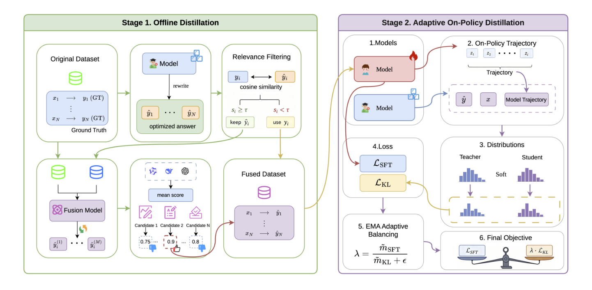
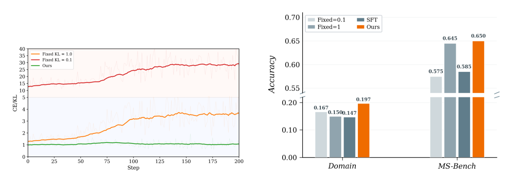
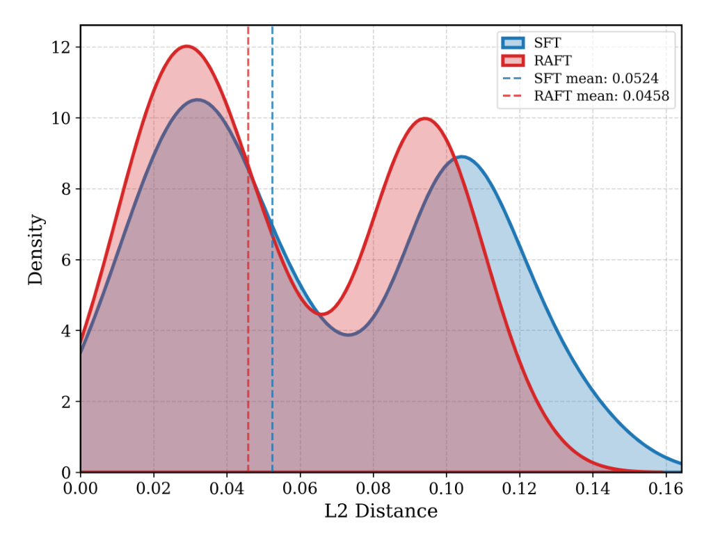

<!-- paper-reading-lang: zh-CN -->
<!-- paper-reading-theme: forest -->
# RAFT：数据精炼 × 轨迹级蒸馏，治领域微调的“遗忘”

> **阅读定位**：领域 SFT 提升领域能力的同时，往往损伤模型的通用能力。这篇论文把损伤归因到两条具体缺口，提出两阶段框架 RAFT，并让同一份“融合答案”同时充当兼容的监督信号与教师的答案上下文，把数据端和训练端的补救扣在一起。原文为 Yuduo Li、Xiaofeng Shi（通讯）、Qian Kou、Longbin Yu、Hua Zhou 的 *RAFT: Data Refinement and Adaptive Distillation for Domain Fine-Tuning with Alleviated Forgetting*（BAAI × 北京交通大学）。<span class="source-ref">本图谱依据 <a href="https://arxiv.org/abs/2606.00147v1">arXiv:2606.00147v1</a>（2026-05-29）PDF，共 19 页：正文 9 页 + 附录 A–H。覆盖 PDF §§1–6、Figs. 1–8、Tables 1–4、附录 A–H。</span>

## 01 / 全局：遗忘从两条缺口进来

**一句话主线：** 作者认为，领域 SFT 的灾难性遗忘不是单一原因造成的——它同时来自“监督信号与模型不兼容”（数据端）和“模型自身轨迹上没有约束”（训练端）；只补一端的方法都不够，RAFT 用一份融合答案把两端耦合起来。（PDF §§1, 3.1）

第一条缺口是**监督兼容性缺口**（supervision-compatibility gap）：领域数据的标准答案在表达风格和推理格式上与模型自己的输出分布相距很远。强迫模型拟合这样的答案会造成剧烈的参数漂移，覆盖预训练获得的知识。（PDF §1）

第二条缺口是**轨迹保持缺口**（trajectory-preservation gap）：teacher-forced 的 SFT 只在固定目标 token 上优化，从不约束模型在“自己生成的前缀”上的行为。而模型实际推理时走的恰恰是自己的前缀——原始行为因此得不到保持。（PDF 摘要， §1）

论文的关键论点是**两条缺口耦合而非独立**：只改数据（如自蒸馏 SDFT）改善参考答案，却管不住模型在自己轨迹上的漂移；只做在线策略蒸馏（on-policy distillation）约束轨迹，但教师不知道目标答案，会变成一个“保守锚点”，反而限制领域适应。RAFT 的应对是让**融合答案身兼两职**：既是模型兼容的 SFT 监督，又是蒸馏时教师可见的答案上下文。（PDF §1）

```paper-map
{
  "thesis":"领域 SFT 的遗忘由'监督不兼容 + 轨迹无约束'两条耦合缺口造成；RAFT 用同一份融合答案同时补上两端。",
  "outcome":"数据阶段产出模型兼容的融合监督；训练阶段在其上做答案条件的在线策略蒸馏，两者共享融合答案。",
  "outcomeSource":"PDF §§1, 3.2–3.3",
  "items":[
    {"number":"01","label":"问题","signal":"两条耦合缺口","text":"监督兼容性缺口：领域答案的风格/格式与模型自身分布不匹配，强拟合导致参数剧变。轨迹保持缺口：teacher-forcing 不约束模型自身前缀上的行为。","source":"PDF §1"},
    {"number":"02","label":"机制","signal":"离线精炼 + 在线蒸馏","text":"阶段一离线蒸馏：自条件改写 → 余弦相似度过滤 → 强模型融合与多评审优选，得到融合数据集。阶段二自适应在线蒸馏：学生自采样轨迹，答案条件教师给出 Top-K 温度软目标，EMA 自适应平衡两类损失。","source":"PDF §§3.2–3.3, Fig. 1"},
    {"number":"03","label":"证据","signal":"3 模型 × 5 领域","text":"SmolLM3-3B、Llama-3.2-3B-Instruct、Phi-4-mini-instruct 上五个领域的主表，数据/目标/平衡三组消融，参数 ℓ2 距离、MMLU 与保持率三组旁证。","source":"PDF §4, Tables 1–4, Figs. 2–8"}
  ]
}
```

**证据入口总览：** 主结果（Table 1）是三模型 × 五领域的完整矩阵；消融（Table 2、Fig. 2）逐一拆开数据融合、在线蒸馏目标、EMA 平衡三者的贡献；附录补充超参扫描（τ、T、K）、权重距离（Fig. 3）、MMLU（Fig. 8）和保持率（Table 4）。（PDF §4，附录 A–H）

## 02 / 主路径：一条样本的两段旅程

RAFT 的流程可以跟着一条样本走完：先在离线阶段被改写成更“合身”的监督，再在在线阶段同时驱动 SFT 损失和蒸馏约束。下面的路径图标出每个阶段的输入、动作、设计理由和产出。（PDF §§3.2–3.3, Fig. 1）

```paper-path
{
  "title":"从原始问答到带约束的领域微调",
  "intro":"阶段一（离线蒸馏）只动数据，阶段二（自适应在线蒸馏）只动训练目标；融合答案 ŷ 是两个阶段的连接点。",
  "stages":[
    {"title":"自条件改写","role":"让监督向模型靠拢","action":"对每条样本 (x, y)，由原指令模型以标准答案 y 为条件重新生成答案 ỹ ∼ p_θ(·|x, y)。","why":"保留事实内容，但把表达风格适配到模型自身的输出分布，缩小监督与模型之间的距离（Eq. 1）。","output":"风格兼容、但事实需要核对的候选答案 ỹ。","source":"PDF §3.2, Eq. 1"},
    {"title":"语义过滤","role":"挡住语义漂移","action":"用预训练句向量 φ 计算原答案与改写的余弦相似度 s（Eq. 2）；s ≥ τ 才采用改写，否则回退原答案 y（Eq. 3）；默认 τ = 0.8。","why":"无质量控制的自我改写可能偏离原意，直接采用会把错误累积进训练数据。","output":"逐样本可信的改写结果 ȳ。","source":"PDF §3.2, Eqs. 2–3；附录 E.1"},
    {"title":"融合与多评审优选","role":"产出最终监督","action":"通过过滤的样本由融合模型（Qwen3-32B）把 y 与 ȳ 融合成更高质量答案 ŷ；多个评审模型独立打分，多轮融合取平均得分最高者，均分 ≥ 0.8 可提前停止。","why":"单次融合有随机性，多评审、多轮优选抑制个体波动，保证融合质量。","output":"融合数据集 D̂：过滤通过处用 ŷ，未通过处保留 y（Eq. 4）。","source":"PDF §3.2, Eq. 4；附录 C–D"},
    {"title":"学生自采样轨迹","role":"把约束放到真实行为上","action":"每个训练步，当前学生模型先对 x 自回归采样一条轨迹 z（Eq. 6）。","why":"在线轨迹覆盖的是模型推理时真正会到达的状态空间，离线参考答案轨迹覆盖不到。","output":"学生自己的回答轨迹 z。","source":"PDF §3.3, Eq. 6"},
    {"title":"答案条件教师软监督","role":"目标感知的轨迹约束","action":"原指令模型充当教师，输入是「参考知识提示 r + 融合答案 ŷ + 问题 x + 学生前缀 z_{<t}」的拼接；在相同轨迹位置上给出软目标分布（Eq. 7，拼接模板见附录 H）。","why":"学生轨迹可能偏离教师的自然写法；教师「看着答案」评分，才能既保通用行为、又把学生引向领域目标，而不是单纯保守回拉。","output":"逐位置、目标感知的教师分布。","source":"PDF §3.3, Eq. 7；附录 H"},
    {"title":"Top-K 温度 KL + EMA 平衡","role":"稳定地融合两类损失","action":"教师/学生 logits 经温度 T = 1.5 平滑后，只在教师概率最高的 K = 512 个 token 上重归一化并计算 KL（Eqs. 8–10）；λ(s) 由 SFT 与 KL 损失的 EMA 比值自适应给出，总损失 L = L_SFT + λ(s)·L_KL（Eqs. 11–12）。","why":"温度 + Top-K 让监督聚焦最有信息量的 token、防止分布塌缩；两类损失量纲不同且随训练漂移，固定系数无法全程平衡。","output":"最终训练目标；无需人工调蒸馏权重。","source":"PDF §3.3, Eqs. 8–12"}
  ]
}
```

**两阶段如何“耦合”？** 耦合点不是流程上的串联，而是同一份融合答案 ŷ 的双重身份：在 SFT 损失里它是学生要拟合的目标；在蒸馏损失里它是教师的上下文。作者的这一设计把教师从“纯粹保守的锚”变成“知道目标的向导”——学生学领域知识的同时，仍被约束在原模型的行为模式附近。（PDF §3.3 末段）

**原论文 Fig. 1 是整个框架的鸟瞰，建议按下述路线读：** 左半（绿色）是阶段一离线蒸馏——原始数据集经模型改写、余弦相似度过滤（s ≥ τ 保留改写，否则用原答案），再由 Fusion Model 融合、多个评审模型打平均分，产出融合数据集；右半（紫色）是阶段二——注意第 3 步教师与学生分布经软化后在 Top-K 上对齐，第 5 步 λ 由两个损失的 EMA 比值自动给出（天平图），而非人工设定。左右两半通过融合数据集连接。（PDF p. 2, Fig. 1）



*原论文 Fig. 1，PDF p. 2。图中“Relevance Filtering”即正文的语义过滤（Eqs. 2–3）；右侧第 3 步的软化直方图对应温度平滑与 Top-K 截断（Eqs. 8–9）。此图是核对第 02 节路径的原始画法。*

## 03 / 机制特写：四个关键操作

理解 RAFT 不需要记住全部十二步，抓住四个操作即可：语义过滤决定“用不用改写”，答案条件决定“教师怎么指导”，Top-K 温度决定“蒸馏算什么”，EMA 平衡决定“两类损失各占多重”。

### 语义过滤：改写必须用，但不能乱用

自我改写的风险是**语义漂移**——改写后风格合身了、意思却变了。RAFT 用预训练句向量 $\phi$ 把文本映到 $d$ 维空间，计算原答案与改写的余弦相似度：（PDF §3.2, Eq. 2）

$$
s_i=\frac{\phi(y_i)^{\top}\phi(\tilde{y}_i)}{\lVert\phi(y_i)\rVert\cdot\lVert\phi(\tilde{y}_i)\rVert}
$$

再用阈值 $\tau$ 做逐样本裁决：（PDF §3.2, Eq. 3）

$$
\bar{y}_i=\begin{cases}\tilde{y}_i, & s_i\geq\tau\\ y_i, & s_i<\tau\end{cases}
$$

低于阈值就**回退到原始答案**，防止错误在自我强化中累积。这个阈值不是随手定的：附录 E.1 在 Open Culture 上扫描 $\tau\in\{0,0.3,0.5,0.8,1.0\}$，两项指标都在 $\tau=0.8$ 达到峰值（D-Acc 19.7%、MS-Bench 65.0%）；两个极端都更差——$\tau=0$ 不过滤（13.3% / 60.5%），$\tau=1.0$ 几乎没有改写能通过（13.1% / 55.0%）。作者据此把 $\tau=0.8$ 设为全局默认，并指出过滤不仅是防错兜底，更是主动提升数据质量的机制。（PDF 附录 E.1, Fig. 4）

### 答案条件：教师“看着答案”给学生打分

在每个轨迹位置 $t$，学生与教师面对**同一段学生前缀** $z_{i,<t}$，但看到的信息不对称：（PDF §3.3, Eq. 7）

$$
p^{S}_{\theta}(\cdot \mid x_i,\, z_{i,<t}),\qquad p^{T}_{\psi}(\cdot \mid r,\, \hat{y}_i,\, x_i,\, z_{i,<t})
$$

学生只条件于问题 $x_i$；教师的输入是参考提示 $r$、融合答案 $\hat{y}_i$、问题 $x_i$ 与前缀的顺序拼接。附录 H 给出实际模板：`Background reference knowledge: {融合答案}` + `Answer the question based on the reference knowledge: {问题}` + `Answer: {学生轨迹}`。（PDF 附录 H.1–H.2）

作者给这个非对称设计两条理由（**论文陈述**）：其一“知情指导”——教师知道参考答案，在学生轨迹的每个位置上能给出更有信息量的软目标；其二“分布对齐”——教师的 logits 反映“一个掌握标准答案的模型”会如何分配概率，引导学生更好泛化，同时保留学生自己的生成风格。（PDF 附录 H.3）

```paper-contrast
{
  "title":"同样是在线蒸馏：保守锚点，还是目标感知向导",
  "intro":"两种设计都在学生轨迹上做 KL 约束，差别只在教师是否看到目标答案；这个差别决定了约束的方向。",
  "branches":[
    {"name":"普通 on-policy 蒸馏","lead":"教师与学生看到相同的上下文，只反映原模型的自然行为。","scope":"约束学生轨迹不偏离原模型分布。","judge":"教师不知道领域目标答案，无法判断学生的偏离是'遗忘'还是'学会领域知识'。","signal":"把学生拉回「原模型本来会怎么写」；论文认为这会充当保守锚点，限制领域适应。","why":"只有行为约束、没有目标感知时，'保持原行为'与'学新知识'相互掣肘。","source":"PDF §§1–2, 3.3"},
    {"name":"RAFT 答案条件蒸馏","lead":"教师额外条件于融合答案 ŷ，带着参考答案评估学生轨迹。","scope":"同样的学生轨迹，但软目标指向领域答案。","judge":"教师能区分'朝向正确答案的偏离'与'无目标的漂移'。","signal":"软目标既保留原模型的行为模式，又把学生推向领域目标；融合答案同时是 SFT 监督，两端共享同一目标。","why":"数据端的兼容监督与训练端的轨迹约束通过 ŷ 扣合，而不是两个独立技巧的简单叠加。","source":"PDF §3.3；附录 H.3"}
  ]
}
```

### Top-K 温度蒸馏：只在教师最在意的 token 上对齐

记教师、学生在位置 $(i,t)$ 的 logits 为 $u_{i,t}$、$v_{i,t}$，温度 $T>0$。先做温度平滑（防止分布塌缩到单一 token、保持多样性）：（PDF §3.3, Eq. 8）

$$
q_{i,t}(a)=\frac{\exp(u_{i,t}(a)/T)}{\sum_{b\in\mathcal{V}}\exp(u_{i,t}(b)/T)},\qquad p^{(T)}_{i,t}(a)=\frac{\exp(v_{i,t}(a)/T)}{\sum_{b\in\mathcal{V}}\exp(v_{i,t}(b)/T)}
$$

再取**教师**概率最高的 $K$ 个 token 构成集合 $\mathcal{K}_{i,t}=\mathrm{TopK}(q_{i,t},K)$，把两个分布都截断到该集合并重新归一化：（PDF §3.3, Eq. 9）

$$
\tilde{q}_{i,t}(a)=\frac{q_{i,t}(a)\,\mathbb{1}[a\in\mathcal{K}_{i,t}]}{\sum_{b\in\mathcal{K}_{i,t}}q_{i,t}(b)},\qquad \tilde{p}_{i,t}(a)=\frac{p^{(T)}_{i,t}(a)\,\mathbb{1}[a\in\mathcal{K}_{i,t}]}{\sum_{b\in\mathcal{K}_{i,t}}p^{(T)}_{i,t}(b)}
$$

蒸馏损失带标准的 $T^2$ 补偿因子（抵消温度缩放带来的梯度变小）：（PDF §3.3, Eq. 10）

$$
\mathcal{L}_{\mathrm{KL}}=T^{2}\,\frac{1}{N}\sum_{i=1}^{N}\frac{1}{L_i}\sum_{t=1}^{L_i}\mathrm{KL}\!\left(\tilde{q}_{i,t}\,\Vert\,\tilde{p}_{i,t}\right)
$$

注意集合 $\mathcal{K}_{i,t}$ 由**教师**分布选出，学生分布只是被截断到同一集合上——蒸馏的方向因此是“教师认为重要的 token，学生要跟上”。作者给出 $K=512$ 的双重依据：教师分布高度集中，Top-256 已覆盖 99.2% 概率质量、Top-512 覆盖 99.6%，再往上边际收益锐减而 GPU 时间持续增长。（PDF §3.3；附录 E.3, Fig. 6）

**教学算例（本图谱自造，非论文实验）：** 设某位置教师 top-3 token 的概率为 $[0.50, 0.30, 0.10]$，$K{=}3$ 时覆盖率 $0.90$，重归一化得 $\tilde q=[0.556, 0.333, 0.111]$；若学生在同样三个 token 上的温度平滑概率为 $[0.20, 0.20, 0.10]$（合计 $0.50$），则 $\tilde p=[0.40, 0.40, 0.20]$。KL 只在这三个 token 上计算，词表其余部分完全不进入损失——这就是“计算量下降”与“聚焦信息量”的来源。

### EMA 自适应平衡：让两类损失全程“等重”

SFT 用交叉熵、蒸馏用 KL，两者量纲不同且随训练漂移，固定系数无法全程平衡。RAFT 在第 $s$ 步对两个损失各维护一个带偏差校正的指数滑动平均（$\beta\in(0,1)$，实验取 0.9）：（PDF §3.3, Eq. 11）

$$
m_k^{(s)}=\beta\, m_k^{(s-1)}+(1-\beta)\,\mathcal{L}_k^{(s)},\qquad \hat{m}_k^{(s)}=\frac{m_k^{(s)}}{1-\beta^{s}},\quad k\in\{\mathrm{SFT},\mathrm{KL}\}
$$

自适应权重与最终目标为：（PDF §3.3, Eq. 12）

$$
\lambda^{(s)}=\frac{\hat{m}^{(s)}_{\mathrm{SFT}}}{\hat{m}^{(s)}_{\mathrm{KL}}+\epsilon},\qquad \mathcal{L}^{(s)}=\mathcal{L}^{(s)}_{\mathrm{SFT}}+\lambda^{(s)}\,\mathcal{L}^{(s)}_{\mathrm{KL}}
$$

机制很直白：$\mathcal{L}_{\mathrm{KL}}$ 相对偏小时 $\lambda$ 自动增大、加强蒸馏约束，反之减弱，使 $\lambda\mathcal{L}_{\mathrm{KL}}$ 始终与 $\mathcal{L}_{\mathrm{SFT}}$ 标量量级相当，无需人工调参。（PDF §3.3）

**教学算例（本图谱自造，非论文实验）：** 设某步偏差校正后 $\hat m_{\mathrm{SFT}}=2.0$、$\hat m_{\mathrm{KL}}=0.5$，则 $\lambda\approx 2.0/0.5=4$，蒸馏项 $\lambda\cdot\mathcal{L}_{\mathrm{KL}}=4\times0.5=2.0$，与 SFT 项恰好等重。若后期 KL 降到 $0.1$，$\lambda$ 升到约 $20$，仍保持两项等重——这正是论文 Fig. 2a 中“Ours”曲线把 CE/KL 比值稳定在 1 附近的含义。（对应证据见 04 节，PDF §4.3.3, Fig. 2）

## 04 / 实验图谱：每张表各回答什么

**统一实验设置（读所有数字前先看这里）：** 三个约 3B 的指令模型（SmolLM3-3B、Llama-3.2-3B-Instruct、Phi-4-mini-instruct）；五个领域（Business & Industry、Law & Government、Open Culture、Open Science、Open Web），数据从 CCI4.0 与 Common Corpus 用大模型抽取问答对并经多模型过滤，平均每领域约 2,000 条。三个互补指标：D-Acc（领域测试集准确率，gpt-oss-120b、DeepSeek-v3.2、Qwen3-32B 三评审多数投票）、MS-Bench（主观问答，多评审投票）、IFEval（指令遵循格式）；MMLU 作客观推理旁证。训练统一为 3 epochs、batch 16、lr 5×10⁻⁶、AdamW、BF16、A100；蒸馏默认 T=1.5、K=512、τ=0.8、β=0.9。主实验约 1,000 GPU 小时，含预试总计不超过 2,000 小时。基线：SFT、SDFT（自蒸馏）、on-policy（在线蒸馏）、FAPM（遗忘感知剪枝），均用各自推荐超参。（PDF §4.1）

```paper-experiments
{
  "title":"每个实验能回答的问题",
  "rows":[
    {"question":"RAFT 是否改善'领域-通用'的平均权衡？","setup":"Table 1：三模型 × 五领域完整矩阵，与 SFT/SDFT/on-policy/FAPM 同协议比较；平均行报告五领域均值，括号内为相对 SFT 的相对提升。","observation":"三个骨架平均：D-Acc +23.2%、MS-Bench +18.2%、IFEval +10.2%（相对 SFT）。逐骨架看 D-Acc 相对提升为 +34.0%（SmolLM3）、+9.2%（Llama）、+26.3%（Phi-4-mini）。论文自承 RAFT 并非在每个模型-领域单元格都最优，胜在平均权衡。","source":"PDF §4.2, Table 1"},
    {"question":"融合数据单独有多大贡献？","setup":"Table 2：同一模型（SmolLM3-3B）、同样 SFT，仅把原始数据换成融合数据；三个代表性领域。","observation":"换数据后 D-Acc 全面上升：L&G 12.8→13.7、Sci 8.3→10.0、Cul 13.1→14.8（相对 +7.0%/+20.5%/+13.0%）；MS-Bench 同步 +4.5%/+3.2%/+6.4%。说明更强的融合监督本身就有价值。","source":"PDF §4.3.1, Table 2"},
    {"question":"在线蒸馏目标单独有多大贡献？","setup":"同用融合数据，比较'融合数据+SFT'与完整 RAFT，差异只能归因于自适应在线蒸馏目标。","observation":"D-Acc 再升至 18.0/13.3/19.7（相对 +31.4%/+33.0%/+33.1%）；IFEval 相对 +8.5%/+20.2%/+18.2%；MS-Bench 小幅 +0.7%/+1.6%/+11.1%。训练目标与数据策略互补，联合最强。","source":"PDF §4.3.2, Table 2"},
    {"question":"EMA 自适应平衡是否必要？","setup":"Open Culture 上对比固定 λ∈{0.1, 1.0} 与 EMA 自适应；Fig. 2a 画 CE/KL 比值曲线，Fig. 2b 画最终指标。","observation":"固定 λ 的比值曲线全程剧烈漂移（λ=1.0 升到约 3–4，λ=0.1 升到约 28），EMA 稳定在 1 附近。终点：λ=0.1→16.7/57.5，λ=1.0→15.0/64.5，EMA→19.7/65.0 双优。注意：Fig. 2b 中标注为 SFT 的柱（14.7/58.5）与 Table 2 的'融合数据+SFT'（14.8/58.5）一致，并非原始数据 SFT（13.1/55.0）——此处的'无蒸馏基线'应读作融合数据 SFT。","source":"PDF §4.3.3, Fig. 2"},
    {"question":"遗忘能在参数层面测到吗？","setup":"附录 A：测微调后权重相对原始指令模型的逐层相对 ℓ2 距离分布（SmolLM3-3B）。","observation":"RAFT 均值 0.0458，SFT 0.0524，相对降低 12.6%；分布整体左移。作者自己提醒：权重距离不是遗忘的唯一因素，此结果与 MS-Bench/IFEval 的功能层面证据方向一致。","source":"PDF 附录 A, Fig. 3"},
    {"question":"通用能力保持率与客观推理怎样？","setup":"附录 G 以 base 模型为分母定义保持率 Retention = 方法分/base 分；附录 F 测 MMLU。","observation":"MS-Bench 平均保持率 76.8%（SFT）→89.2%（RAFT），IFEval 91.2%→99.5%；MMLU 各方法在 50.3%–54.3% 之间，域内差异 ≤2 个百分点，RAFT 在五域中四域最高或接近最高。","source":"PDF 附录 F–G, Fig. 8, Table 4"}
  ]
}
```

**主表平均行精选（Table 1 的 Avg 块，单位 %）：** 下表是三骨架各自五领域均值；括号是论文给出的相对 SFT 的相对变化。读法建议：先竖看 SFT 相对 Base 的“遗忘幅度”（如 Phi-4-mini 的 MS-Bench 52.5→31.5），再横看各方法把曲线拉回来多少。（PDF §4.2, Table 1）

| 骨架 | 方法 | D-Acc | MS-Bench | IFEval |
|---|---|---:|---:|---:|
| SmolLM3-3B | Base | 10.6 | 68.0 | 31.2 |
| SmolLM3-3B | SFT | 12.8 | 61.5 | 24.9 |
| SmolLM3-3B | SDFT | 13.1 (+2.3) | 60.3 (−2.0) | 25.2 (+1.2) |
| SmolLM3-3B | on-policy | 12.7 (−0.8) | 60.7 (−1.3) | 26.8 (+7.6) |
| SmolLM3-3B | FAPM | 10.7 (−16.4) | 59.2 (−3.7) | 31.2 (+25.3) |
| SmolLM3-3B | **RAFT** | **17.2 (+34.0)** | **66.8 (+8.6)** | **31.4 (+26.1)** |
| Llama-3.2-3B | Base | 7.3 | 46.0 | 51.2 |
| Llama-3.2-3B | SFT | 15.1 | 36.8 | 49.9 |
| Llama-3.2-3B | SDFT | 14.5 (−4.0) | 36.1 (−1.9) | 48.8 (−2.2) |
| Llama-3.2-3B | on-policy | 13.6 (−9.9) | 40.4 (+9.8) | 48.3 (−3.2) |
| Llama-3.2-3B | FAPM | 7.3 (−51.7) | 43.2 (+17.4) | 51.2 (+2.6) |
| Llama-3.2-3B | **RAFT** | **16.5 (+9.2)** | **40.1 (+9.0)** | **51.6 (+3.5)** |
| Phi-4-mini | Base | 11.6 | 52.5 | 55.5 |
| Phi-4-mini | SFT | 17.1 | 31.5 | 53.4 |
| Phi-4-mini | SDFT | 17.4 (+1.8) | 33.6 (+6.7) | 53.8 (+0.7) |
| Phi-4-mini | on-policy | 17.4 (+1.8) | 40.2 (+27.6) | 53.4 (0.0) |
| Phi-4-mini | FAPM | 14.2 (−17.0) | 53.6 (+70.2) | 55.5 (+3.9) |
| Phi-4-mini | **RAFT** | **21.6 (+26.3)** | **43.2 (+37.1)** | 53.9 (+1.0) |

基线各自的短板印证了“只补一端不够”的论点：FAPM 在 SmolLM3 上 IFEval 与 base 持平（31.2），但 D-Acc 只有 10.7、甚至低于普通 SFT 的 12.8——纯剪枝正则保得住通用、学不进领域；SDFT 与 on-policy 的提升则随模型而变（如二者在 Llama 上反而拉低 D-Acc）。Table 1 的平均行按三个骨架、三项指标比较，RAFT 在其中六项取得微调方法的最高值；它并非全胜，例如 Llama 和 Phi-4-mini 的 MS-Bench 以及 Phi-4-mini 的 IFEval 均由 FAPM 更高。这些是整系统比较，不是受控部件实验。（PDF §4.2, Table 1）

```paper-chart
{"type":"paired","title":"五领域平均 D-Acc：SFT → RAFT","subtitle":"按骨架分列；单位：%","origin":"本文重绘 · 原论文 Table 1 Avg 行","note":"仅比较 SFT 与 RAFT 两个端点；Base 与其他基线见上表。","source":"PDF p. 7, Table 1","rows":[{"label":"SmolLM3-3B","before":12.8,"after":17.2},{"label":"Llama-3.2-3B","before":15.1,"after":16.5},{"label":"Phi-4-mini","before":17.1,"after":21.6}]}
```

```paper-chart
{"type":"paired","title":"五领域平均 MS-Bench：SFT → RAFT","subtitle":"按骨架分列；单位：%","origin":"本文重绘 · 原论文 Table 1 Avg 行","note":"MS-Bench 衡量通用主观问答；Base 水平分别为 68.0 / 46.0 / 52.5，RAFT 是恢复而非超越。","source":"PDF p. 7, Table 1","rows":[{"label":"SmolLM3-3B","before":61.5,"after":66.8},{"label":"Llama-3.2-3B","before":36.8,"after":40.1},{"label":"Phi-4-mini","before":31.5,"after":43.2}]}
```

**消融表（Table 2，SmolLM3-3B，单位 %）：** 三行是“原始数据+SFT → 融合数据+SFT → 完整 RAFT”的阶梯，每一步只动一个因素，因此可以分别归因。（PDF §4.3, Table 2）

| 领域 | 设置 | D-Acc | MS-Bench | IFEval |
|---|---|---:|---:|---:|
| L&G | 原始数据 + SFT | 12.8 | 66.5 | 25.1 |
| L&G | 融合数据 + SFT | 13.7 | 69.5 | 28.3 |
| L&G | **RAFT（完整）** | **18.0** | **70.0** | **30.7** |
| Sci | 原始数据 + SFT | 8.3 | 62.0 | 23.5 |
| Sci | 融合数据 + SFT | 10.0 | 64.0 | 27.2 |
| Sci | **RAFT（完整）** | **13.3** | **65.0** | **32.7** |
| Cul | 原始数据 + SFT | 13.1 | 55.0 | 25.3 |
| Cul | 融合数据 + SFT | 14.8 | 58.5 | 25.3 |
| Cul | **RAFT（完整）** | **19.7** | **65.0** | **29.9** |

阶梯读法：换数据（第二行）带来的增益温和且三项俱全；加在线蒸馏（第三行）把 D-Acc 大幅推高、IFEval 显著回升——数据策略与训练目标是互补的两级，而不是可互相替代的一招。（PDF §§4.3.1–4.3.2）

**原论文 Fig. 2 回答“EMA 平衡为什么必要”，左右两半要分开读：** 左图（Fig. 2a）的纵轴是 CE/KL 比值——两条固定 λ 曲线随训练持续爬升（λ=0.1 到约 28、λ=1.0 到约 3–4），意味着损失相对权重全程失控；绿色“Ours”几乎贴在 1 附近。右图（Fig. 2b）看终点指标：固定系数陷入此消彼长（λ 从 0.1 增到 1.0 时 MS-Bench 57.5→64.5 但 D-Acc 16.7→15.0），EMA（橙柱）同时拿到最高 D-Acc 19.7% 与最高 MS-Bench 65.0%。（PDF §4.3.3, Fig. 2）



*原论文 Fig. 2，PDF p. 9。读图注意：右图标注“SFT”的柱（0.147/0.585）与 Table 2“融合数据+SFT”的数值一致，应理解为融合数据上的无蒸馏基线，而非原始数据 SFT（13.1/55.0）——这是本图谱跨表核对后的读法，论文正文未明说。*

**原论文 Fig. 3 提供参数层面的旁证：** 两条曲线是微调后权重相对原始模型的逐层 ℓ2 距离分布（密度），虚线是各自均值。RAFT（红）整体在 SFT（蓝）左侧，均值 0.0458 对 0.0524。它说明 RAFT 的参数更新更保守，与功能层面的 MS-Bench/IFEval 保持相互印证；但作者提醒权重距离并非遗忘的唯一决定因素，此图只作方向性证据。（PDF 附录 A, Fig. 3）



*原论文 Fig. 3，PDF p. 12。横轴是相对 ℓ2 距离，纵轴是密度；两条虚线为均值。*

**超参扫描速览（附录 E，均在 SmolLM3-3B 上）：** 三项扫描分别支撑三个默认值的选取——τ：两指标同峰于 0.8（D-Acc 19.7 / MS-Bench 65.0），两端（0 与 1.0）皆差；T：D-Acc 随 T 单调升（1.0 时 17.3 → 1.8 时 22.2），但 MS-Bench 峰在 T=1.5（71.5），故取 1.5 作折中，论文标注推荐区间 [1.5, 1.8]；K：Top-512 覆盖教师 99.6% 概率质量，D-Acc 在 K=512 处显著尖峰（19.7，K≤256 时仅 13.3、K=1024 掉到 11.7、K=2048 回到 13.6），MS-Bench 对 K 不敏感（64.5–67.5 间波动）——作者据此判断 K 主要影响领域适应质量而非通用保持。（PDF 附录 E.1–E.3, Figs. 4–7）

## 05 / 综合：耦合为什么有效，边界在哪里

把机制与证据合起来看，RAFT 的核心不是“又一种防遗忘技巧”，而是一个**耦合断言**：领域 SFT 的遗忘同时从数据端（监督不兼容）和训练端（轨迹无约束）进入，因此补救也必须在两端同时落子、且共用同一个目标载体。实验为这条断言提供了阶梯式支持——只换融合数据（Table 2 第二行）三项指标温和改善；只在这一数据上加答案条件的在线蒸馏（第三行）D-Acc 与 IFEval 大幅跃升；EMA 平衡则保证这种联合在全程稳定（Fig. 2）。参数距离（Fig. 3）与保持率（Table 4）从另外两个角度给出同方向的旁证。（PDF §§4.2–4.3，附录 A、G）

**这套证据的适用范围要一起读：** （读者视角的边界梳理，非论文结论）其一，所有模型都在约 3B 规模，作者在 Limitations 中明确说更大模型的可扩展性待验证；其二，五个领域都是 QA 形态、每域约 2,000 条，代码生成、多语场景与更大语料未覆盖（作者同样自承）；其三，D-Acc 与 MS-Bench 都由三个评审模型多数投票产生，评审本身（gpt-oss-120b、DeepSeek-v3.2、Qwen3-32B）是度量链的一环，换评审可能改变绝对读数；其四，D-Acc 的绝对值在 10%–30% 区间，本文的结论应读作相对 SFT 的改善幅度，而非领域任务的绝对水平。（PDF §§4.1, 6）

**复现要点清单：** 离线阶段——改写用学生模型自己、过滤 τ=0.8、融合模型 Qwen3-32B、多评审均分 ≥0.8 提前停止（提示词模板见附录 C–D）；训练阶段——T=1.5、K=512、EMA β=0.9、3 epochs、batch 16、lr 5×10⁻⁶、AdamW（wd 0.01）、BF16、A100；教师输入拼接模板见附录 H.2；MMLU 与保持率定义见附录 F–G。（PDF §4.1，附录 C–H）

**来源核对小注（跨表/跨引用核对时发现）：** ① 正文 §4.1 写作 “CCL4.0”，但其引用条目 [Liu et al., 2025] 实为 CCI4.0（arXiv:2506.07463，双语预训练数据集）——应系笔误；② Fig. 2b 的 “SFT” 柱数值对应“融合数据+SFT”而非原始数据 SFT（见 04 节 Fig. 2 处分析）；③ 摘要与 §4.2 的 23.2%/18.2%/10.2% 是三个骨架相对提升的均值，与 Table 1 括号内数值一致。（PDF §§4.1–4.2, Fig. 2；参考文献）
